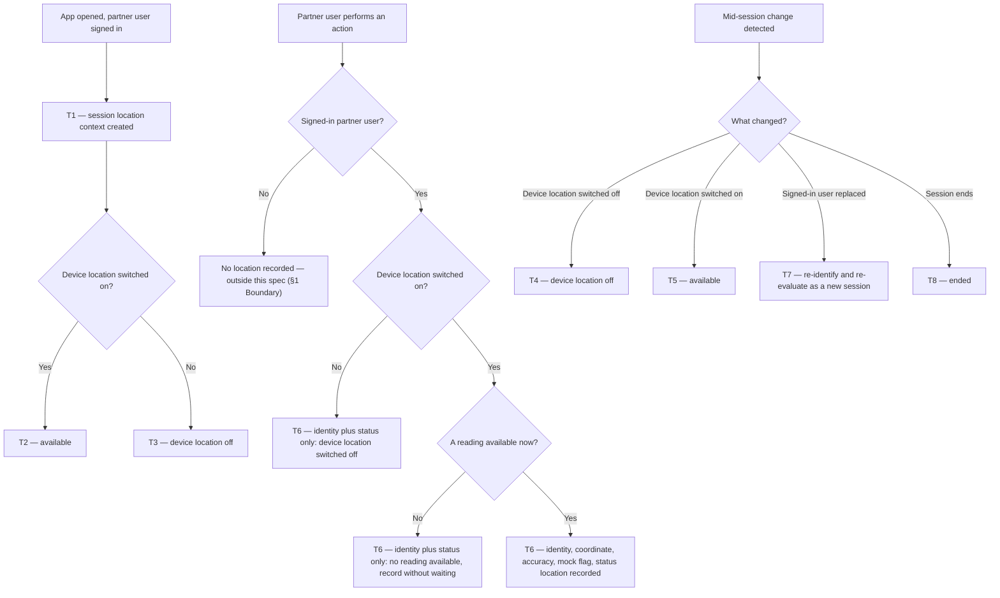

# Partner Action Location — where CSP users work from

| | | | |
|---|---|---|---|
| **Owner** — Ashish Raj (PM) | **Reviewer** — TBD (Eng Lead) | **Status** — In review | **Sign-off** — Pending |
| **Version** — v1.6 · 31 Jul 2026 | **Consulted — Legal/DPDP** — TBD | **Consulted — Android** — TBD | **Consulted — Analytics** — TBD |

---

## 1. Objective & Definition of Success

**Objective.** For any action a partner user takes in the CSP app or the Technician app, Wiom can tell **who** did it and **where** they physically were — the person identified beyond doubt, the location as accurate as the device can report it, and a fabricated reading never passing as a measured one.

> **No customer outcome.** This is an internal capability; no customer experience changes. Recorded as **OV-1**.

**Boundary.** This spec governs **who performed each action and where they were when they performed it**, in both apps, across every module, service and role (C-02). It changes no service's behaviour, no state machine and no task outcome. **Every flow must behave exactly as it does today** — each task family (INSTALL, RESTORE, RECHARGE, NETBOX_PICKUP, OUTAGE, SHIFTING) and each flow that carries no task, such as sign-in, the feed, the drilldowns, wallet and profile (AC-REG-4, AC-REG-5, AC-REG-6, AC-REG-7). The **customer app is entirely out of scope** (AC-REG-1). Obtaining a reading must never make an action slower or less reliable (R4, G3). The existing use of location for WiFi scanning during router configuration must continue to work unchanged (AC-REG-2). This spec captures where each action happened; it defines no comparison against any reference point.

**Assumption this spec rests on.** Both apps already require location permission before they can be used, and both re-ask if it is withdrawn. Permission acquisition is therefore not specified here, and coverage depends on that remaining true — if either app ever makes location optional, M1 and M2 fall with it.

### Guardrails — promises that hold on every path

| ID | Guardrail | One line | Anchors |
|---|---|---|---|
| G1 | **Self-describing readings** | No coordinate is ever recorded without its accuracy radius and its mock flag. | R2a · R2b · AC-CAP-1 · AC-GRD-1 · MQ-2 |
| G2 | **No silent gap** | Every partner action carries a location status, so a missing coordinate is always explained rather than merely absent. | R3a · AC-CAP-4 · AC-GRD-2 · MQ-3 |
| G3 | **Capture costs the partner nothing** | No action is ever blocked, delayed or degraded in order to obtain a reading. | R4a · R4b · AC-GRD-3 · MQ-4 |
| G4 | **No consequence without corroboration** | Location is never the sole basis for a payout, posture, access or disciplinary consequence against an individual; it may direct an investigation that stands on other evidence. | R5b · AC-GRD-4 · MQ-5 |
| G5 | **One identified person per record** | Every recorded action is attributable to exactly one partner user, named by an identifier that is never shared between people and never reused. | R6a · R6d · AC-GRD-5 · MQ-8 |

### Success metrics

| ID | Metric | Baseline | Target | Source |
|---|---|---|---|---|
| M1 | Partner users with location data on at least one action performed in the app | n/a — new capability | set after first production data | MQ-6 |
| M2 | Share of a partner user's actions that carry location data | n/a — new capability | set after first production data | MQ-7 |

**Invariant (not a metric):** G3 — partner actions blocked, delayed or degraded in order to obtain a reading = 0, zero tolerance. Monitored via MQ-4, not trended.

**Invariant (not a metric):** G5 — recorded actions that cannot be attributed to exactly one identified partner user = 0, zero tolerance. Monitored via MQ-8, not trended.

---

## 2. User Stories & Rules

| ID | Story | MUST | MUST NOT |
|---|---|---|---|
| R1 | As the PM for partner operations, I want every action a partner user takes in either app to record where it happened — today's actions and every action added later — so I can see where each role actually does its job from without having to ask for each new one to be wired up. | **(a)** Record latitude and longitude against every action a signed-in partner user takes, in both apps, across every module and service. **(b)** Cover every kind of interaction the apps already report as a CleverTap event, screen opens and taps included — not only actions that change a task's state. **(c)** Cover every action defined in future from its first release, so a newly added event carries the same location and identity data as the actions that exist today. How and where the capture happens is the implementer's design (§9). | **(a)** Record location against customer-app activity. **(b)** Record location against a user who is not signed in as a partner user. **(c)** Ship a new partner-user action without the data this spec requires. |
| R2 | As an analyst acting on a named individual's data, I need the most accurate reading the device can give, and I need to know when a coordinate was fabricated rather than measured. | **(a)** Record the most accurate location the device can provide without delaying the action, aiming for C-01, together with its accuracy radius in metres. **(b)** Record whether the reading came from a mock-location provider. **(c)** Fetch the location when the action happens and record it as part of that action, never by a later pass over actions already recorded. | Record a latitude or longitude without its accuracy radius and its mock flag (G1). |
| R3 | As an analyst, I need to know why a coordinate is missing, so that absence is a finding rather than a hole. | **(a)** Record a location status against **every** partner action, drawn from: location recorded · no reading available · device location switched off. | Record a partner action with the status absent or empty (G2). |
| R4 | As a partner user, I want the app to be exactly as fast and reliable as before, because I am paid to finish jobs, not to wait for a map. | **(a)** Let every action complete at its normal speed whether or not a reading is available, never holding it to wait for one. **(b)** Record the action with a status from R3a when no reading is available, rather than retrying or holding it. | **(a)** Block, delay or degrade any action in order to obtain a reading (G3). **(b)** Show a partner any error, warning or prompt because a reading was unavailable at the moment they acted. |
| R5 | As the PM, I need to analyse a named individual and a named booking, and to understand how partner users behave in aggregate — because "which partner did this" and "where does this role actually work from" are the questions the data exists to answer. | **(a)** Permit analysis down to an individual partner user, a named booking and a named action, and keep that analysis available to the PM for as long as the data is held. **(b)** Require evidence other than location before any payout, posture, access or disciplinary consequence is applied to an individual. **(c)** Hold the recorded data where the PM can query it directly — filtering and grouping freely across users, roles, apps, services, task families, action types and dates — without an engineering request for each new question. **(d)** Keep every location record tied to the action it belongs to: what that action was, and the task or booking it relates to where one exists. | **(a)** Apply a consequence to an individual on the strength of location data alone (G4). **(b)** Leave any part of the recorded data reachable only through engineering — every field this spec requires is queryable by the PM. |
| R6 | As the PM, I must know exactly **whose** location I am looking at — a specific person, beyond doubt, not a device and not a guess — and I must be able to split behaviour by role. | **(a)** Record, against every action, an identifier that names the signed-in partner user uniquely and is never reused for a different person. **(b)** Record the CSP that user acts for. **(c)** Record their role. **(d)** Attribute every action to the user signed in at the instant it happened, re-establishing all three whenever the signed-in user changes without the app restarting. | **(a)** Attribute an action to the device, to a login shared between people, or to a user who was signed in earlier. **(b)** Infer role from the app a user signed in from — a MANAGER may use either app. |

---

## 3. System Behaviour

### 3a. System flow chart

**Precedence.**
- **P1 — the action never waits for the reading.** An action performed while a location request is in flight is recorded immediately with whatever reading already exists, or with status *no reading available* if none exists. A reading that arrives afterwards is not attached to it (AC-RACE-1, AC-RACE-2, G3).

### 3b. State transition table — canon

Lifecycle of the **location context of an app session** (created when a partner user opens either app while signed in). Neighbouring lifecycles out of scope: the apps' own permission flows, which already require location permission before the app can be used and re-ask if it is withdrawn (§1 Assumption); the sign-in and session lifecycle itself, which this spec reads but does not govern; every service's task lifecycles; the customer app's session; and the router-configuration WiFi-scanning flow, which reads the same OS permission but is untouched by this spec.

**The four states.** **Undetermined** — session open, the device's location setting not yet evaluated. **Available** — device location switched on; readings obtainable. **Device location off** — the device's own location setting is off, so no reading can be obtained. **Ended** — the session has closed; terminal.

| ID | From | Action / Trigger | Rule / Check | To | Side-effects |
|---|---|---|---|---|---|
| T1 | — | Partner user opens the app while signed in | — | Undetermined | Session location context created; the signed-in user's identifier, CSP and role established (R6a, R6b, R6c). The device location setting is evaluated before any action is recorded, so no action is ever recorded from Undetermined (T2, T3). |
| T2 | Undetermined | Device location setting evaluated | Switched on | Available | Actions begin carrying coordinate, accuracy and mock flag per T6 (R1a, R2). |
| T3 | Undetermined | Device location setting evaluated | Switched off | Device location off | Actions carry status *device location switched off* (R3a, G2). No action is blocked (G3). |
| T4 | Available | Device location setting switched off | — | Device location off | Actions carry status *device location switched off* (R3a, G2). No action is blocked (G3). |
| T5 | Device location off | Device location setting switched on | — | Available | Actions resume carrying coordinate, accuracy and mock flag (R2). Nothing is backfilled for actions already recorded. |
| T6 | Available · Device location off | Partner user performs an action | Dispatched by the §3a action chart | *No change* | Record carries: the signed-in user's identifier, CSP and role (R6a, R6b, R6c, G5); coordinate when a reading is available; the accuracy radius in metres and the mock flag whenever a coordinate is present (R2a, R2b, G1); location status always (R3a, G2). The location is fetched when the action happens (R2c) and the action is never held to wait for one (P1, G3). |
| T7 | Undetermined · Available · Device location off | The signed-in partner user is replaced without the app restarting | — | Undetermined | Context re-evaluated from T1; the new user's identifier, CSP and role established before any of their actions is recorded (R6d, G5); no reading obtained under the previous user is carried into the new user's records. |
| T8 | Undetermined · Available · Device location off | App session ends | — | Ended | Session location context discarded; no reading is retained by the app between sessions. |

---

## 4. Screen Requirements

**Experience intent:** a partner user should never notice this feature. It asks nothing of them beyond the permission the apps already require, and it never interrupts a job.

**No new or changed screens.** Location permission is already handled by each app's existing permission flow, and the device-location-off prompt already exists in the app. This feature adds no screen, changes no screen, and shows the partner nothing new (R4-b MUST NOT, AC-REG-3). Recorded as **OV-4**.

---

## 5. Configurability

| ID | Parameter | Default | Range | Who changes it |
|---|---|---|---|---|
| C-01 | Target accuracy for a recorded reading — the accuracy the app aims for without delaying the action (R2a) | 20 metres | Pending engineering review — see **OV-5** | Engineering |
| C-02 | Roles in scope (R1a) | OWNER, TECHNICIAN, MANAGER, MANAGER+ | Fixed in V1 | Product |

**Note on C-01.** 20 metres is a target, not a filter. A reading the device can only place within 500 metres is still recorded, with 500 metres as its accuracy radius (R2a, AC-CAP-2) — the number is never hidden or rounded to look better than it is.

---

## 6. Measurement

| ID | The system must be able to answer… | Feeds |
|---|---|---|
| MQ-1 | For a named partner user over a named date range: where was each of their actions performed, broken down by role, by app and by service. | Objective · R1a · R5a · R6a |
| MQ-2 | For each partner action: the accuracy radius, and whether the reading came from a mock-location provider. | G1 · R2a · R2b · C-01 |
| MQ-3 | For partner actions carrying no coordinate: the reason, by status value, split by app and role. | G2 · R3a |
| MQ-4 | Whether any partner action was blocked, delayed or degraded in order to obtain a reading. | G3 invariant · R4a · R4b |
| MQ-5 | For any consequence applied to a partner user, what non-location evidence supported it. | G4 · R5b |
| MQ-6 | The number of partner users with location data on at least one action. | M1 |
| MQ-7 | For each partner user, and overall: the share of their actions that carry location data. | M2 |
| MQ-8 | For every recorded action: the identifier, CSP and role of the partner user who performed it — and whether any action is missing any of the three, or carries an identifier that maps to more than one person. | G5 invariant · R6a · R6b · R6c |
| MQ-9 | The count and identity of partner users producing mock-location readings. | G1 · R2b |
| MQ-10 | Across all partner users over any date range: how their actions distribute by location, grouped by role, app, service, task family and action type. | Objective · R5c · R5d |
| MQ-11 | For a named task or booking: every action performed on it, by whom, of what kind, and where. | R5a · R5d |
| MQ-12 | Which action types carry no location data at all — including action types first seen after launch, so a newly added one that missed the capture shows up rather than passing unnoticed. | R1b · R1c · R1-c MUST NOT |

---

## 7. Acceptance Criteria

All examples use a synthetic partner: CSP **WIOM-GGN-0472**, owner **Ramesh Kumar** (`csp_owner_88214`, role OWNER), technician **Sunil Yadav** (`tech_31907`, role TECHNICIAN), and booking **BKG-2026-07-118342** whose customer address is **28.4389, 77.0512** (Gurugram).

### CAP — Capture against an action (T6)

| AC | Given / When / Then | Verifies | Status |
|---|---|---|---|
| AC-CAP-1 | **Given** Sunil signed in and the device able to report 28.4390, 77.0511 with a 12 m accuracy radius, **When** he marks himself arrived at site for BKG-2026-07-118342, **Then** the action's record carries that latitude and longitude, accuracy 12 m, mock flag false, and status *location recorded*. | R1a · R2a · R2b · R3a · T6 · G1 | Settled |
| AC-CAP-2 | **Given** C-01 at 20 m but the best the device can report is a 500 m accuracy radius, **When** Sunil acts, **Then** the record carries that coordinate with accuracy 500 m — the coordinate is still recorded, the accuracy is reported as 500 m and not as 20 m, and the action is not delayed to obtain a better one. | R2a · C-01 · T6 · P1 | Settled |
| AC-CAP-3 | **Given** Ramesh signed in with the device's location setting switched off, **When** he opens a task drilldown, **Then** that **screen open** is recorded with status *device location switched off* and no coordinate. | R1b · R3a · T3 · T6 · G2 | Settled |
| AC-CAP-4 | **Given** Sunil in a session where no reading is available, **When** he taps a CTA, **Then** the record carries status *no reading available* — the status is present and non-empty. | R3a · T6 · G2 | Settled |
| AC-CAP-5 | **Given** a device running a mock-location provider reporting 28.4389, 77.0512 while Sunil is two kilometres away, **When** he performs any action, **Then** the record carries that coordinate with mock flag **true**. | R2b · T6 · G1 · MQ-9 | Settled |
| AC-CAP-6 | **Given** a customer using the customer app at 28.4389, 77.0512, **When** they act, **Then** no latitude, longitude or location status is recorded against them. | R1-a MUST NOT · §1 Boundary | Settled |
| AC-CAP-7 | **Given** either app at the login screen with nobody signed in, **When** any interaction occurs, **Then** no latitude, longitude or location status is recorded. | R1-b MUST NOT | Settled |
| AC-CAP-8 | **Given** Sunil acting at 14:00:00, **When** his action is recorded, **Then** the location was fetched at 14:00:00 as part of that action — no later pass adds or changes the coordinate on it. | R2c · T6 | Settled |
| AC-CAP-9 | **Given** Sunil signed in, **When** he performs actions of four different kinds in one session — opens the feed, opens a netbox-recovery drilldown, submits an install step, and opens his wallet — **Then** every one of those four records carries his identifier `tech_31907`, his CSP **WIOM-GGN-0472** and his role **TECHNICIAN**, with no lookup needed to know who acted. | R6a · R6b · R6c · T6 · G5 | Settled |
| AC-CAP-10 | **Given** a week in which Ramesh and Sunil work tasks of all six families — INSTALL, RESTORE, RECHARGE, NETBOX_PICKUP, OUTAGE and SHIFTING — and also sign in, browse the feed, open drilldowns, use the wallet and open their profiles, **When** the records for that week are inspected, **Then** every action of every kind carries a location status and an identifier, and a coordinate wherever one was available — no task family and no flow is absent. | R1a · R1b · R3a · R6a · T6 · G2 · G5 | Settled |
| AC-CAP-11 | **Given** a new partner-user action added to either app after this feature ships — a new reschedule tap in the shifting flow, say — **When** it is released and Sunil uses it, **Then** its records carry the same location status, identifier, CSP, role and coordinate as any action that existed before it, with no change required to that new action's own code. | R1c · R1-c MUST NOT · T6 · G2 · G5 · MQ-12 | Settled |

### SESS — Session, identity and device-location state (T1–T5, T7, T8)

| AC | Given / When / Then | Verifies | Status |
|---|---|---|---|
| AC-SESS-1 | **Given** Sunil opening the Technician app with the device location setting on, **When** the session starts, **Then** his identifier, CSP and role are established before his first action is recorded, and that action carries a coordinate with its accuracy radius and mock flag. | T1 · T2 · R6a · R6b · R6c · R2 · G1 | Settled |
| AC-SESS-2 | **Given** Ramesh opening the CSP app with the device location setting off, **When** the session starts, **Then** his first action carries status *device location switched off* and no coordinate. | T1 · T3 · R3a · G2 | Settled |
| AC-SESS-3 | **Given** Sunil in a live session with readings available, **When** he switches the device location setting off, **Then** his subsequent actions carry status *device location switched off*. | T4 · R3a · G2 | Settled |
| AC-SESS-4 | **Given** Sunil in a live session with the device location setting off, **When** he switches it back on, **Then** his subsequent actions carry coordinates again and no earlier record is altered. | T4 · T5 · R2 | Settled |
| AC-SESS-5 | **Given** Sunil signed in on a shared handset with a reading obtained at the customer address, **When** he signs out and Ramesh signs in on the same handset without the app restarting, **Then** Ramesh's actions carry `csp_owner_88214` and role OWNER, none of them carries `tech_31907`, and none carries the reading obtained while Sunil was signed in. | T7 · R6d · R6-a MUST NOT · G5 | Settled |
| AC-SESS-6 | **Given** Ramesh has a live session with a reading available, **When** he closes the app and reopens it after 4 hours with the device location setting off, **Then** his first action of the new session carries status *device location switched off* — the previous session's reading is not reused. | T8 · T1 · T3 · R3a · G2 | Settled |
| AC-SESS-7 | **Given** a MANAGER+ user, **When** they act in the CSP app and later in the Technician app, **Then** their records carry role MANAGER+ in both cases, under the same identifier. | R6a · R6c · R6-b MUST NOT | Settled |

### WF — Workflows (T1 → T2 → T6, and T1 → T3 → T6)

| AC | Given / When / Then | Verifies | Status |
|---|---|---|---|
| AC-WF-1 | **Given** Sunil with the device location setting on, **When** he completes the on-site sequence for BKG-2026-07-118342 from arrival through to the customer rating, **Then** every step in that sequence has a record carrying his identifier, CSP and role, a coordinate, its accuracy radius, its mock flag and a status — with no gaps in the sequence. | R1a · R1b · R2 · R6a · R6b · R6c · T6 · G1 · G5 | Settled |
| AC-WF-2 | **Given** Ramesh with the device location setting off all day, **When** he works a full day — opens the feed, assigns Sunil to BKG-2026-07-118342, opens a netbox-recovery task, and reports one install failed — **Then** every action completes at normal speed, every record carries status *device location switched off*, and no error, warning or prompt appeared during any action. | R4a · R4b · R4-b MUST NOT · T3 · T6 · G2 · G3 | Settled |

### FAIL — Capture never depends on a reading (T6)

| AC | Given / When / Then | Verifies | Status |
|---|---|---|---|
| AC-FAIL-1 | **Given** a location request in flight with no reading yet available, **When** Sunil taps a CTA, **Then** the record is written immediately with status *no reading available*, the action completes with no added latency, and nothing waits for the reading. | R4a · P1 · G3 · MQ-4 | Settled |
| AC-FAIL-2 | **Given** location capture failing outright on Ramesh's device — every request erroring — **When** he assigns a technician to BKG-2026-07-118342, **Then** the assignment completes normally and no error, prompt or block is shown. | R4-a MUST NOT · R4-b MUST NOT · G3 | Settled |

### REG — Regression: every flow behaves exactly as before (§1 Boundary)

| AC | Given / When / Then | Verifies | Status |
|---|---|---|---|
| AC-REG-1 | **Given** this feature live in both partner apps, **When** the customer app is exercised end to end for BKG-2026-07-118342, **Then** its behaviour, screens and records are unchanged from the pre-change build. | §1 Boundary | Settled |
| AC-REG-2 | **Given** this feature live, **When** Sunil runs router configuration for BKG-2026-07-118342, **Then** WiFi scanning returns networks and the router-config flow completes exactly as it did before this feature. | §1 Boundary | Settled |
| AC-REG-3 | **Given** this feature live, **When** both apps are exercised end to end on a fresh install, **Then** every screen — the permission flow and the device-location-off prompt included — is identical to the pre-change build. | §4 · §1 Assumption | Settled |
| AC-REG-4 | **Given** this feature live, **When** the full booking-to-install journey for BKG-2026-07-118342 is run, **Then** every state transition, timer and notification behaves exactly as in the pre-change build. | §1 Boundary · G3 | Settled |
| AC-REG-5 | **Given** this feature live, **When** a task of each other family is run end to end — RESTORE, RECHARGE, NETBOX_PICKUP, OUTAGE and SHIFTING — **Then** each completes with the same states, timers, notifications and outcomes as in the pre-change build. | §1 Boundary · G3 | Settled |
| AC-REG-6 | **Given** this feature live, **When** the flows that carry no task are exercised — sign-in, the feed, every task drilldown, wallet and withdrawal, and profile — **Then** each behaves exactly as in the pre-change build. | §1 Boundary · G3 | Settled |
| AC-REG-7 | **Given** this feature live, **When** any action in any flow fails for its own reasons — a rejected submission, a network error, a validation failure — **Then** it fails the same way and with the same message as in the pre-change build, with no location-related wording anywhere in the failure. | §1 Boundary · R4-b MUST NOT · G3 | Settled |

### RACE — Precedence rule (P1)

| AC | Given / When / Then | Verifies | Status |
|---|---|---|---|
| AC-RACE-1 | **Given** a location request in flight with no reading yet, **When** Sunil acts and the reading arrives 200 ms later, **Then** his action was already recorded with status *no reading available*, and the late reading is not attached to it. | P1 · R2c · R3a · T6 | Settled |
| AC-RACE-2 | **Given** a reading already available and two actions performed within the same 100 ms, **When** both are recorded, **Then** both carry that same coordinate with its accuracy radius and mock flag, and neither action was delayed. | P1 · R2a · R2b · T6 | Settled |
| AC-RACE-3 | **Given** Sunil signed in and an action in flight, **When** the signed-in user is replaced by Ramesh before that action is recorded, **Then** the action is attributed to Sunil, who performed it — not to Ramesh. | R6d · R6-a MUST NOT · T7 · G5 | Settled |

### DUP — Duplicate triggers

| AC | Given / When / Then | Verifies | Status |
|---|---|---|---|
| AC-DUP-1 | **Given** Sunil double-tapping a CTA 400 ms apart with a reading available, **When** both actions are recorded, **Then** each carries the coordinate, its accuracy radius, its mock flag and his identifier — neither record is dropped, and the two are not merged into one. | R2a · R2b · R6a · T6 · P1 | Settled |
| AC-DUP-2 | **Given** Ramesh backgrounding and reopening the CSP app three times in a minute, **When** each open is evaluated, **Then** the device location setting is re-evaluated each time and his identifier, CSP and role are carried on every action throughout. | T1 · T2 · R6a · R6b · R6c | Settled |

### GRD — Guardrails

| AC | Given / When / Then | Verifies | Status |
|---|---|---|---|
| AC-GRD-1 | **Given** any sample of partner records carrying a coordinate, **When** the sample is inspected, **Then** every one also carries an accuracy radius and a mock flag — zero coordinates appear without both. | G1 · R2a · R2b · R2-MUST NOT · MQ-2 | Settled |
| AC-GRD-2 | **Given** any sample of partner records, **When** the sample is inspected, **Then** every one carries a non-empty location status from the R3a set. | G2 · R3a · R3-MUST NOT · MQ-3 | Settled |
| AC-GRD-3 | **Given** a full week of production traffic, **When** MQ-4 is run, **Then** zero partner actions were blocked, delayed or degraded in order to obtain a reading. | G3 invariant · R4-a MUST NOT · MQ-4 | Settled |
| AC-GRD-4 | **Given** a partner user whose location data suggests actions were performed somewhere unexpected, **When** any payout, posture, access or disciplinary consequence is applied, **Then** a record of non-location evidence supporting it exists. | G4 · R5b · R5-a MUST NOT · MQ-5 | Settled |
| AC-GRD-5 | **Given** a full week of production traffic, **When** MQ-8 is run, **Then** every record carries exactly one partner-user identifier with a CSP and a role, and no identifier is found against two different people. | G5 invariant · R6a · R6-a MUST NOT · MQ-8 | Settled |

### ANL — Analysis (R5)

| AC | Given / When / Then | Verifies | Status |
|---|---|---|---|
| AC-ANL-1 | **Given** a week of captured records, **When** the PM queries for Ramesh Kumar's actions between 25 and 31 Jul, **Then** the result lists each action with his identifier, CSP, role, the kind of action, the task or booking it belonged to, coordinate, accuracy radius, mock flag, status, app and service. | R5a · R5d · R6a · MQ-1 | Settled |
| AC-ANL-2 | **Given** a month of captured records, **When** the PM writes their own query grouping every action by role and by service and asks where those actions happened, **Then** the result covers every partner user who acted that month and returns without an engineering request. | R5c · R5-b MUST NOT · MQ-10 | Settled |
| AC-ANL-3 | **Given** BKG-2026-07-118342, on which Ramesh assigned a technician and Sunil then completed the on-site sequence, **When** the PM queries that booking, **Then** every action performed on it is listed with who performed it, what kind of action it was, and where they were. | R5a · R5d · MQ-11 | Settled |
| AC-ANL-4 | **Given** a week in which tasks of all six families were worked — INSTALL, RESTORE, RECHARGE, NETBOX_PICKUP, OUTAGE and SHIFTING — **When** the PM queries by task family, **Then** actions from every one of the six are present, and screen opens appear alongside submissions. | R1b · R5c · R5d · MQ-10 | Settled |
| AC-ANL-5 | **Given** the retention period once Engineering has set it, **When** the PM queries the oldest data still inside it, **Then** every field this spec requires is present and queryable on those records. | R5a · R5c | Settled |

---

## 8. Glossary

| Term | Meaning | Owner (domain) |
|---|---|---|
| Partner user | **Canonical definition:** a person signed in to the CSP app or the Technician app in one of the C-02 roles. Excludes customers and unauthenticated users. All other mentions cite this definition. | Partner operations |
| Action | **Canonical definition:** any interaction a partner user has with either app that the app already reports — a screen open, a tap, a submission. Not limited to interactions that change a task's state (R1b). Every one of these is already defined and logged today as a CleverTap event, each carrying its own event properties and a timestamp — so the actions this spec covers are the events already defined. The set is not closed: any action defined in future joins it from the moment it ships (R1c). | Product |
| Identifier | **Canonical definition:** the value that names one partner user and only ever that person. It must be unique across all partner users, stable for the life of that person's relationship with Wiom, and never reissued to somebody else — otherwise two people's movements merge into one history (R6a, G5). | Partner operations |
| Reading | A single location obtained from the device, carrying a latitude, a longitude and an accuracy radius. | — |
| Accuracy radius | The device's own estimate, in metres, of how far the true position may be from the reported coordinate. A satellite reading is typically tens of metres; one derived from WiFi or cell towers can be hundreds of metres or more. A large radius is not an error — it is an honest statement of imprecision, which is why R2a requires it alongside every coordinate. | — |
| Location status | The single value recorded against every partner action explaining what location it carries. R3a is the canonical list of values; no other section restates it. | Product |
| Mock location | A coordinate injected by a mock-location provider rather than measured by the device. Android exposes a mock-location setting that any spoofing app can be pointed at, and reports per reading whether it was used. R2b requires the flag alongside every coordinate so a fabricated reading is never indistinguishable from a measured one. | — |

---

## 9. Notes for System Capabilities

What the platform must be able to do for this feature to exist. Whether these are one system or several, and how they interact, is the implementer's design.

| Capability | Needed by |
|---|---|
| Obtain the most accurate device location available without delaying the action, aiming for C-01, and carrying an accuracy radius and a mock-provider indication. | R2a · R2b · T6 · P1 · C-01 |
| Fetch the location at the instant an action happens and carry it with that action, rather than reconciling it onto the action later. | R2c · AC-CAP-8 · AC-RACE-1 |
| Name the signed-in partner user with an identifier that is unique, stable and never reused, and carry it — with the user's CSP and role — on every recorded action. | R6a · R6b · R6c · G5 · MQ-8 |
| Re-establish who is signed in, and their CSP and role, when the signed-in user changes without the app restarting — and attribute an action already in flight to whoever performed it. | R6d · T7 · AC-RACE-3 |
| Read the device's location setting at session start and when it changes mid-session. | T2 · T3 · T4 · T5 |
| Record location against **every** partner action from one place, so no kind of interaction can be missed, no individual callsite needs to know about location, and any action defined in future inherits the capture without being wired up for it. | R1a · R1b · R1c · R3a · G1 · G2 · AC-CAP-11 |
| Report which action types carry no location data, so one that missed the capture is visible rather than silently absent. | R1c · MQ-12 |
| Change the target accuracy without an app release. | C-01 |
| Distinguish "no reading available" from "device location switched off" as separate observable states. | R3a · G2 · MQ-3 |
| Discard a reading when the session ends or the signed-in user changes, so no cross-user reading is ever attached. | T7 · T8 |
| Hold the recorded data where the PM can query it directly — grouping and filtering across users, roles, apps, services, task families, action types and dates — for as long as the data is held, without an engineering request per question. | R5a · R5c · MQ-1 · MQ-10 · AC-ANL-1 · AC-ANL-2 |
| Preserve the link from each location record to the action it belongs to, and to that action's task or booking where one exists. | R5d · MQ-11 · AC-ANL-3 |

---

## Open questions

Recorded as **OV-7**. Each must be closed before sign-off.

| # | Question | Owner |
|---|---|---|
| 1 | How long is location data retained? The product requirement is that the PM can run the analysis in MQ-1 and MQ-5 for as long as the data is held (R5a); the retention period itself is Engineering's to propose. | Engineering |
| 2 | What range should C-01 carry? The 20 m default is set; the tolerable range depends on what field devices achieve without adding latency (OV-5). | Engineering |
| 3 | Reviewer, and the Legal/DPDP, Android and Analytics consulted names. | PM |

---

## Overrides

| Rule | What was done instead | Rationale | Who approved |
|---|---|---|---|
| **OV-1** — §1 requires the Objective to be a customer outcome. | The objective is an internal capability. No customer-facing behaviour changes on any path. | The feature exists to let Wiom understand where partner users work from. There is no customer outcome to state, and inventing one would misdescribe the feature. Same override as the Call Logs PRD. | Ashish Raj (PM), 29 Jul 2026 |
| **OV-2** — §1 requires a baseline and a target for every metric. | M1 and M2 carry "n/a — new capability" and no target. | Nothing about partner location is captured today, so there is no proxy baseline and no defensible target. Both are set once production data exists. | Ashish Raj (PM), 30 Jul 2026 |
| **OV-3** — §7 AC citations use `Rn-x MUST NOT` for negative sub-obligations. | The template's `R5b` form is ambiguous when both the MUST and MUST NOT cells are lettered, as several rules here are. Negative obligations are cited as `R4-a MUST NOT`. | Without it, coverage of the MUST NOT column cannot be checked mechanically. | Ashish Raj (PM), 29 Jul 2026 |
| **OV-4** — §4 requires a block per screen the feature touches. | No screen blocks appear; §4 states that no screen is added or changed. | Every screen involved — the permission flow and the device-location-off prompt — already exists in both apps. Specifying them would create a second home for facts this document does not govern. | Ashish Raj (PM), 30 Jul 2026 |
| **OV-5** — §5 requires a range for every C-id. | C-01 carries a default of 20 m but no range. | The tolerable range depends on what devices in the field can actually achieve without adding latency, which Engineering is better placed to measure than the PM is to guess. | Ashish Raj (PM), 30 Jul 2026 |
| **OV-7** — the template defines no Open-questions section. | One is added after §9, replacing the AI-generated-content section now that every generated item has been ruled on. | Four questions remain and two of them are Engineering's, not the PM's. Dropping them to close the section would lose them; leaving an empty review table would say nothing. | Ashish Raj (PM), 30 Jul 2026 |
| **OV-6** — §7 requires boundary-value and configurability ACs where a limit or a runtime-changeable parameter exists. | Neither group appears. | C-01 is a target the app aims for rather than a threshold that changes behaviour at its edges — AC-CAP-2 covers what happens when it is not met. No other PM-owned numeric limit exists. | Ashish Raj (PM), 30 Jul 2026 |
