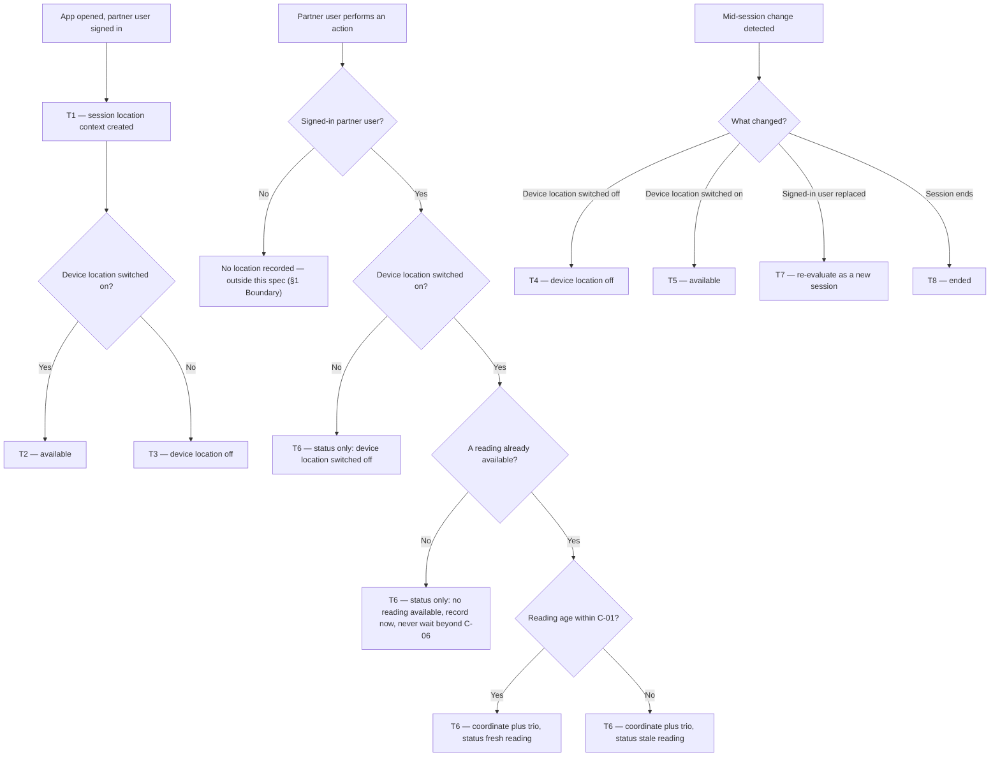

# Partner Action Location — where CSP users work from

| | | | |
|---|---|---|---|
| **Owner** — Ashish Raj (PM) | **Reviewer** — TBD (Eng Lead) | **Status** — Draft | **Sign-off** — Pending |
| **Version** — v0.5 · 30 Jul 2026 | **Consulted — Legal/DPDP** — TBD | **Consulted — Android** — TBD | **Consulted — Analytics** — TBD |

---

## 1. Objective & Definition of Success

**Objective.** For any action a partner user takes in the CSP app or the Technician app, Wiom can tell where that person physically was — precise enough to tell a partner's own premises apart from a customer's address, and honest enough that every reading declares its own reliability.

> **No customer outcome.** This is an internal capability; no customer experience changes. Recorded as **OV-1**.

**Boundary.** This spec governs **what must be recorded about where a partner user was when they acted**, in both apps, across every module, service and role (C-03). It changes no service's behaviour, no state machine and no task outcome. The **customer app is entirely out of scope** (AC-REG-1). Obtaining a reading must never make an action slower or less reliable (R4, G3). The existing use of location for WiFi scanning during router configuration must continue to work unchanged (AC-REG-2).

**Assumption this spec rests on.** Both apps already require location permission before they can be used, and both re-ask if it is withdrawn. Permission acquisition is therefore not specified here, and coverage depends on that remaining true — if either app ever makes location optional, the coverage this spec promises falls with it. ⚠️ *AI GENERATED — review*

### Guardrails — promises that hold on every path

| ID | Guardrail | One line | Anchors |
|---|---|---|---|
| G1 | **Self-describing readings** ⚠️ *AI GENERATED — review* | No coordinate is ever recorded without its reliability trio — accuracy, age, mock flag. | R2a · R2b · R2c · AC-CAP-1 · AC-GRD-1 · MQ-2 |
| G2 | **No silent gap** ⚠️ *AI GENERATED — review* | Every partner action carries a location status, so a missing coordinate is always explained rather than merely absent. | R3a · AC-CAP-4 · AC-GRD-2 · MQ-3 |
| G3 | **Capture costs the partner nothing** ⚠️ *AI GENERATED — review* | No action is ever blocked, delayed or degraded in order to obtain a reading. | R4a · R4b · AC-GRD-3 · MQ-4 |
| G4 | **No consequence without corroboration** ⚠️ *AI GENERATED — review* | Location is never the sole basis for a payout, posture, access or disciplinary consequence against an individual; it may direct an investigation that stands on other evidence. | R5b · AC-GRD-4 · MQ-5 |

### Success metrics

| ID | Metric | Baseline | Target | Source |
|---|---|---|---|---|
| M1 | Partner actions carrying a high-confidence reading (§8) | n/a — new capability | ≥ 80% ⚠️ *AI GENERATED — review* | MQ-2 |
| M2 | Partner users who are **analysable** — at least C-04 of their actions in a rolling 7 days are high-confidence | n/a — new capability | ≥ 90% ⚠️ *AI GENERATED — review* | MQ-6 |
| M3 | Signed-in partner users whose records carry a populated role | n/a — never measured ⚠️ *AI GENERATED — review* | 100% | MQ-7 |

**Invariant (not a metric):** G3 — partner actions blocked, delayed or degraded in order to obtain a reading = 0, zero tolerance. Monitored via MQ-4, not trended.

---

## 2. User Stories & Rules

| ID | Story | MUST | MUST NOT |
|---|---|---|---|
| R1 | As the PM for partner operations, I want every action a partner user takes in either app to record where it happened, so I can see where each role actually does its job from — and trace a booking that was created at the partner's own shop rather than at the customer's address. | **(a)** Record latitude and longitude against every action a signed-in partner user takes, in both apps, across every module and service. **(b)** Cover every kind of interaction the apps already report, screen opens and taps included — not only actions that change a task's state. | **(a)** Record location against customer-app activity. **(b)** Record location against a user who is not signed in as a partner user. |
| R2 | As an analyst acting on a named individual's data, I need each coordinate to declare how much it can be trusted, so I never place a person somewhere on the strength of a city-level or hours-old reading. | **(a)** Record the accuracy radius in metres alongside every coordinate. **(b)** Record the age of the reading in seconds, measured from the instant the location was obtained to the instant the action happened — **not** to the instant the record is stored, so a record held on the device and sent later still states its true age. ⚠️ *AI GENERATED — review* **(c)** Record whether the reading came from a mock-location provider. | Record a latitude or longitude without its accuracy, its age and its mock flag (G1). |
| R3 | As an analyst, I need to know why a coordinate is missing, so that absence is a finding rather than a hole. | **(a)** Record a location status against **every** partner action, including actions with no coordinate, drawn from: fresh reading · stale reading · no reading available ⚠️ *AI GENERATED — review* · device location switched off. **(b)** Treat an approximate-only permission grant as usable, and record the resulting coordinate with the large accuracy radius the device actually gives — never as a precise one. ⚠️ *AI GENERATED — review* | **(a)** Record a partner action with the status absent or empty (G2). **(b)** Attach a coordinate to any action whose status is *no reading available* or *device location switched off*. ⚠️ *AI GENERATED — review* |
| R4 | As a partner user, I want the app to be exactly as fast and reliable as before, because I am paid to finish jobs, not to wait for a map. | **(a)** Let every action complete at its normal speed whether or not a reading is available, waiting no longer than C-06 for one. **(b)** Record the action with a status from R3a when no reading is available, rather than retrying or holding it. | **(a)** Block, delay or degrade any action in order to obtain a reading (G3). **(b)** Show a partner any error, warning or prompt because a reading was unavailable at the moment they acted. |
| R5 | As the PM, I need to analyse a named individual and a named booking, because "which partner did this" is the question the data exists to answer. | **(a)** Permit analysis down to an individual partner user, a named booking and a named action. **(b)** Require evidence other than location before any payout, posture, access or disciplinary consequence is applied to an individual. ⚠️ *AI GENERATED — review* | Apply a consequence to an individual on the strength of location data alone (G4). ⚠️ *AI GENERATED — review* |
| R6 | As an analyst, I want to split behaviour by role, because the whole question is whether OWNERs, TECHNICIANs, MANAGERs and MANAGER+ work from different places. ⚠️ *AI GENERATED — review* | **(a)** Record the role of the signed-in partner user against their actions, in both apps. **(b)** Re-establish the role when the signed-in user changes without the app restarting. | Infer role from the app a user signed in from — a MANAGER may use either app. |

---

## 3. System Behaviour

### 3a. System flow chart

**Precedence.**
- **P1 — the action never waits for the reading.** An action performed while a location request is in flight is recorded immediately with whatever reading already exists and that reading's true age, or with status *no reading available* if none exists. Nothing is held longer than C-06 (AC-RACE-1, AC-RACE-2, G3).

### 3b. State transition table — canon

Lifecycle of the **location context of an app session** (created when a partner user opens either app while signed in). Neighbouring lifecycles out of scope: the apps' own permission flows, which already require location permission before the app can be used and re-ask if it is withdrawn (§1 Assumption); every service's task lifecycles; the customer app's session; and the router-configuration WiFi-scanning flow, which reads the same OS permission but is untouched by this spec.

**The four states.** **Undetermined** — session open, the device's location setting not yet evaluated. **Available** — device location switched on; readings obtainable. **Device location off** — the device's own location setting is off, so no reading can be obtained. **Ended** — the session has closed; terminal.

| ID | From | Action / Trigger | Rule / Check | To | Side-effects |
|---|---|---|---|---|---|
| T1 | — | Partner user opens the app while signed in | — | Undetermined | Session location context created; the signed-in user's role established (R6a). The device location setting is evaluated before any action is recorded, so no action is ever recorded from Undetermined (T2, T3). |
| T2 | Undetermined | Device location setting evaluated | Switched on | Available | Actions begin carrying coordinate plus trio per T6 (R1a, R2). |
| T3 | Undetermined | Device location setting evaluated | Switched off | Device location off | Actions carry status *device location switched off* with no coordinate (R3a, R3-b MUST NOT, G2). No action is blocked (G3). |
| T4 | Available | Device location setting switched off | — | Device location off | Any reading already held is discarded; actions carry status *device location switched off* with no coordinate (R3a, R3-b MUST NOT, G2). No action is blocked (G3). |
| T5 | Device location off | Device location setting switched on | — | Available | Actions resume carrying coordinate plus trio (R2). Nothing is backfilled for actions already recorded. |
| T6 | Available · Device location off | Partner user performs an action | Dispatched by the §3a action chart | *No change* | Record carries: coordinate when a reading is available; accuracy in metres, age in seconds and mock flag whenever a coordinate is present (R2a, R2b, R2c, G1); location status always (R3a, G2); the user's role (R6a). Age states the reading-to-action interval however late the record is sent (R2b). The action is never held beyond C-06 (P1, G3). |
| T7 | Undetermined · Available · Device location off | The signed-in partner user is replaced without the app restarting | — | Undetermined | Context re-evaluated from T1; role re-established for the new user (R6b); no reading obtained under the previous user is carried into the new user's records ⚠️ *AI GENERATED — review*. |
| T8 | Undetermined · Available · Device location off | App session ends | — | Ended | Session location context discarded; no reading is retained by the app between sessions ⚠️ *AI GENERATED — review*. |

---

## 4. Screen Requirements

**Experience intent:** a partner user should never notice this feature. It asks nothing of them beyond the permission the apps already require, and it never interrupts a job.

**Master design file:** **not yet created — named gap.** ⚠️ *AI GENERATED — review*

### Device-location-off prompt — design link TBD

The device's own location setting is off, so no reading can be obtained even though the app holds permission (T3, T4).

**States:** shown (device location switched off — T3, T4) · not shown (device location switched on) ⚠️ *AI GENERATED — review*
**Freshness:** on detection of the device location setting changing

| Element | Source / Routes to | Logic |
|---|---|---|
| Field — location-off notice | T3 · T4 | explains that location is allowed for the app but switched off on the device |
| Action — open device location settings | T5 via §3a | routes to the OS setting |
| Action — dismiss | T4 via §3a | always available; the session continues unaffected (R4, G3) |
| Check — never blocking | — | dismissible in every case, and never shown in the middle of an action (R4-b MUST NOT, G3) |

---

## 5. Configurability

| ID | Parameter | Default | Range | Who changes it |
|---|---|---|---|---|
| C-01 | Maximum reading age still recorded as a fresh reading (R3a, T6) | 60 seconds ⚠️ *AI GENERATED — review* | 30–300 s ⚠️ *AI GENERATED — review* | Product + Eng |
| C-02 | Maximum accuracy radius for a reading to count as high-confidence in analysis (M1, MQ-2) | 100 metres ⚠️ *AI GENERATED — review* | 50–500 m ⚠️ *AI GENERATED — review* | Product |
| C-03 | Roles in scope (R1a) | OWNER, TECHNICIAN, MANAGER, MANAGER+ | Fixed in V1 | Product |
| C-04 | Share of a user's rolling-7-day actions that must be high-confidence for that user to count as analysable (M2) | 60% ⚠️ *AI GENERATED — review* | Fixed in V1 | Product |
| C-05 | Retention of location data (MQ-5, Legal gate) | TBD — Legal-gated ⚠️ *AI GENERATED — review* | TBD | Legal + Product |
| C-06 | Maximum time an action may wait for a reading before being recorded without one (R4a, P1) | 0 seconds — never wait ⚠️ *AI GENERATED — review* | 0–3 s ⚠️ *AI GENERATED — review* | Engineering |
| C-07 | Maximum distance from a partner's registered premises within which an action counts as having happened *at* those premises (MQ-8) | 150 metres ⚠️ *AI GENERATED — review* | 50–500 m ⚠️ *AI GENERATED — review* | Product |

**Interaction note (C-01 × C-06):** because C-06 defaults to zero, no action ever pauses for a fresh reading. An action therefore carries whatever reading already exists, and its status is *fresh* or *stale* purely on the C-01 comparison. Raising C-06 above zero shifts records from *no reading available* and *stale* toward *fresh* at the cost of delaying the action — it does not change what any status means. ⚠️ *AI GENERATED — review*

**Interaction note (C-01 × C-02):** the two thresholds are independent and both must pass for M1. A reading 5 seconds old with a 3 km radius is fresh but not high-confidence; one 10 minutes old with an 8 m radius is precise but stale. Analysis that names an individual uses both filters together (R2, R5b). ⚠️ *AI GENERATED — review*

---

## 6. Measurement

| ID | The system must be able to answer… | Feeds |
|---|---|---|
| MQ-1 | For a named partner user over a named date range: where was each of their actions performed, broken down by role, by app and by service. | Objective · R1a · R5a · R6a |
| MQ-2 | For each partner action: the accuracy radius, the age, and whether the reading was mock — and therefore whether it is high-confidence against C-01 and C-02. | G1 · M1 · C-01 · C-02 |
| MQ-3 | For partner actions carrying no coordinate: the reason, by status value, split by app and role. | G2 · R3a |
| MQ-4 | Whether any partner action was blocked, delayed or degraded in order to obtain a reading — including any held past C-06. | G3 invariant · R4a · R4b · C-06 |
| MQ-5 | For any consequence applied to a partner user, what non-location evidence supported it. | G4 · R5b · C-05 |
| MQ-6 | For each partner user: the share of their rolling-7-day actions that are high-confidence, and therefore whether they are analysable. | M2 · C-04 |
| MQ-7 | The share of signed-in partner users whose records carry a populated role. | M3 · R6a · R6b |
| MQ-8 | For a named booking, counting only high-confidence readings: what share of its actions occurred within C-07 of the partner's own registered premises rather than at the customer address. ⚠️ *AI GENERATED — review* | Objective · R1a · R5a · C-07 |
| MQ-9 | The count and identity of partner users producing mock-location readings. ⚠️ *AI GENERATED — review* | G1 · R2c |
| MQ-10 | The share of partner coordinates obtained under an approximate-only permission grant, so a deliberately coarsened reading is never mistaken for a poor satellite one. ⚠️ *AI GENERATED — review* | R3b · C-02 · M1 |

---

## 7. Acceptance Criteria

All examples use a synthetic partner ⚠️ *AI GENERATED — review*: CSP **WIOM-GGN-0472**, owner **Ramesh Kumar** (`csp_owner_88214`, role OWNER), technician **Sunil Yadav** (`tech_31907`, role TECHNICIAN), shop at **28.4212, 77.0431** (Gurugram), and booking **BKG-2026-07-118342** whose customer address is **28.4389, 77.0512** — 2.1 km from the shop.

### CAP — Capture against an action (T6)

| AC | Given / When / Then | Verifies | Status |
|---|---|---|---|
| AC-CAP-1 | **Given** Sunil signed in and the device holding a reading of 28.4390, 77.0511 with a 12 m radius obtained 8 seconds ago, **When** he proposes a slot on BKG-2026-07-118342, **Then** the action's record carries that latitude and longitude, accuracy 12 m, age 8 s, mock flag false, status *fresh reading*, and role TECHNICIAN. | R1a · R2a · R2b · R2c · R3a · R6a · T6 · G1 | Settled |
| AC-CAP-2 | **Given** the same conditions but the only available reading is 14 minutes old with a 2,400 m radius, **When** he acts, **Then** the record carries that coordinate, accuracy 2,400 m, age 840 s, mock flag false, and status *stale reading* — and the action is not delayed to obtain a better reading. | R2a · R2b · R3a · T6 · P1 · C-01 · C-06 | Settled |
| AC-CAP-3 | **Given** Ramesh signed in with the device's location setting switched off, **When** he opens a task drilldown, **Then** that **screen open** is recorded with status *device location switched off*, no coordinate, and no accuracy, age or mock flag. | R1b · R3a · R3-b MUST NOT · T3 · T6 · G2 | Settled |
| AC-CAP-4 | **Given** Sunil in a session where no reading has yet been obtained, **When** he taps a CTA, **Then** the record carries status *no reading available* and no coordinate — the status is present and non-empty. | R3a · R3-b MUST NOT · T6 · G2 | Settled |
| AC-CAP-5 | **Given** a device running a mock-location provider reporting 28.4389, 77.0512 — the customer address — while Sunil is physically at the shop, **When** he submits any install step, **Then** the record carries that coordinate with mock flag **true**. | R2c · T6 · G1 · MQ-9 | Settled |
| AC-CAP-6 | **Given** a customer using the customer app at 28.4389, 77.0512, **When** they act, **Then** no latitude, longitude or location status is recorded against them. | R1-a MUST NOT · §1 Boundary | Settled |
| AC-CAP-7 | **Given** either app at the login screen with nobody signed in, **When** any interaction occurs, **Then** no latitude, longitude or location status is recorded. | R1-b MUST NOT | Settled |
| AC-CAP-8 | **Given** Sunil granted **approximate** location only, and the device returns 28.44, 77.05 with a 2,000 m radius, **When** he acts, **Then** the record carries that coordinate with accuracy 2,000 m and a status set on the C-01 age test alone — and it does not count toward M1 at C-02's 100 m default. | R3b · R2a · C-02 · M1 · MQ-10 | Settled |
| AC-CAP-9 | **Given** Sunil acting at 14:00 with a reading obtained at 13:59:30, and the handset offline until 20:00, **When** the record is sent at 20:00, **Then** its age reads 30 s, not 6 hours 30 s. | R2b · T6 | Settled |

### SESS — Session and device-location state (T1–T5, T7, T8)

| AC | Given / When / Then | Verifies | Status |
|---|---|---|---|
| AC-SESS-1 | **Given** Sunil opening the Technician app with the device location setting on, **When** the session starts, **Then** his role is recorded as TECHNICIAN and his first action carries a coordinate with accuracy, age and mock flag. | T1 · T2 · R6a · R2 · G1 | Settled |
| AC-SESS-2 | **Given** Ramesh opening the CSP app with the device location setting off, **When** the session starts, **Then** his first action carries status *device location switched off* and no coordinate. | T1 · T3 · R3a · G2 | Settled |
| AC-SESS-3 | **Given** Sunil in a live session with a reading available, **When** he switches the device location setting off, **Then** his subsequent actions carry status *device location switched off* with no coordinate, and the reading held before the switch is not attached to any of them. | T4 · R3-b MUST NOT · G2 | Settled |
| AC-SESS-4 | **Given** Sunil in a live session with the device location setting off, **When** he switches it back on, **Then** his subsequent actions carry coordinates again and no earlier record is altered. | T4 · T5 · R2 | Settled |
| AC-SESS-5 | **Given** Sunil signed in on a shared handset with a reading obtained at the customer address, **When** he signs out and Ramesh signs in on the same handset without the app restarting, **Then** Ramesh's records carry role OWNER and none of them carries the reading obtained while Sunil was signed in. | T7 · R6b · R1-b MUST NOT | Settled |
| AC-SESS-6 | **Given** Ramesh has a live session with a reading available, **When** he closes the app and reopens it after 4 hours with the device location setting off, **Then** his first action of the new session carries status *device location switched off* and no coordinate — the previous session's reading is not reused. | T8 · T1 · T3 · R3a · G2 | Settled |
| AC-SESS-7 | **Given** a MANAGER+ user, **When** they act in the CSP app and later in the Technician app, **Then** their records carry role MANAGER+ in both cases. | R6a · R6-MUST NOT · M3 | Settled |

### WF — Workflows (T1 → T2 → T6, and T1 → T3 → T6)

| AC | Given / When / Then | Verifies | Status |
|---|---|---|---|
| AC-WF-1 | **Given** Sunil with the device location setting on, **When** he completes the on-site sequence for BKG-2026-07-118342 from arrival through to the customer rating, **Then** every step in that sequence has a record carrying a coordinate, accuracy, age, mock flag, status and role — with no gaps in the sequence. | R1a · R1b · R2 · R6a · T6 · G1 | Settled |
| AC-WF-2 | **Given** Ramesh with the device location setting off all day, **When** he works a full day — opens the feed, proposes a slot on BKG-2026-07-118342, assigns Sunil, and reports one install failed — **Then** every action completes at normal speed, every record carries status *device location switched off*, and no error, warning or prompt appeared during any action. | R4a · R4b · R4-b MUST NOT · T3 · T6 · G2 · G3 | Settled |

### FAIL — Capture never depends on a reading (T6, C-06)

| AC | Given / When / Then | Verifies | Status |
|---|---|---|---|
| AC-FAIL-1 | **Given** C-06 at its 0-second default and a location request in flight with no reading yet available, **When** Sunil taps a CTA, **Then** the record is written immediately with status *no reading available*, the action completes with no added latency, and nothing waits for the reading. | R4a · P1 · C-06 · G3 · MQ-4 | Settled |
| AC-FAIL-2 | **Given** location capture failing outright on Ramesh's device — every request erroring — **When** he proposes a slot, **Then** the slot proposal completes normally and no error, prompt or block is shown. | R4-a MUST NOT · R4-b MUST NOT · G3 | Settled |

### REG — Regression against the §1 Boundary

| AC | Given / When / Then | Verifies | Status |
|---|---|---|---|
| AC-REG-1 | **Given** this feature live in both partner apps, **When** the customer app is exercised end to end for BKG-2026-07-118342, **Then** its behaviour, screens and records are unchanged from the pre-change build. | §1 Boundary | Settled |
| AC-REG-2 | **Given** this feature live, **When** Sunil runs router configuration for BKG-2026-07-118342, **Then** WiFi scanning returns networks and the router-config flow completes exactly as it did before this feature. | §1 Boundary | Settled |
| AC-REG-3 | **Given** this feature live, **When** either app's permission flow is exercised on a fresh install, **Then** it requests the same permissions in the same order with the same screens as the pre-change build. | §1 Assumption · §1 Boundary | Settled |
| AC-REG-4 | **Given** this feature live, **When** the full booking-to-install journey for BKG-2026-07-118342 is run, **Then** every state transition, timer and notification behaves exactly as in the pre-change build. | §1 Boundary · G3 | Settled |

### RACE — Precedence rule (P1)

| AC | Given / When / Then | Verifies | Status |
|---|---|---|---|
| AC-RACE-1 | **Given** a location request in flight with no reading yet, **When** Sunil acts and the reading arrives 200 ms later, **Then** his action was already recorded with status *no reading available*, and the late reading is not attached to it retrospectively. | P1 · R3a · T6 | Settled |
| AC-RACE-2 | **Given** a location request in flight, **When** two actions occur within the same 100 ms, **Then** both are recorded immediately, both carry the same best-available reading, and each carries its own true age at its own instant. | P1 · R2b · T6 | Settled |

### BV — Boundary values (C-01, C-02, C-04, C-07)

| AC | Given / When / Then | Verifies | Status |
|---|---|---|---|
| AC-BV-1 | **Given** C-01 at 60 s, **When** an action is recorded with a reading aged exactly 60 s, **Then** its status is *fresh reading*. | R3a · C-01 · T6 | Settled |
| AC-BV-2 | **Given** C-01 at 60 s, **When** an action is recorded with a reading aged 61 s, **Then** its status is *stale reading*. | R3a · C-01 · T6 | Settled |
| AC-BV-3 | **Given** C-02 at 100 m, **When** analysis runs over three records with accuracy 99 m, 100 m and 101 m, **Then** the first two count toward M1 and the third does not. | M1 · C-02 · MQ-2 | Settled |
| AC-BV-4 | **Given** C-04 at 60%, **When** one user has 59% of their rolling-7-day actions high-confidence and another has 60%, **Then** only the second counts as analysable in M2. | M2 · C-04 · MQ-6 | Settled |
| AC-BV-5 | **Given** C-07 at 150 m and Ramesh's shop at 28.4212, 77.0431, **When** MQ-8 runs over two high-confidence actions — one 149 m from the shop and one 151 m away — **Then** only the first counts as having happened at his premises. | MQ-8 · C-07 | Settled |

### DUP — Duplicate triggers

| AC | Given / When / Then | Verifies | Status |
|---|---|---|---|
| AC-DUP-1 | **Given** Sunil double-tapping a CTA 400 ms apart with a reading available, **When** both actions are recorded, **Then** each carries the coordinate and the mock flag, and the second carries an age approximately 400 ms greater than the first — neither reuses the other's age. | R2b · R2c · T6 · P1 | Settled |
| AC-DUP-2 | **Given** Ramesh backgrounding and reopening the CSP app three times in a minute, **When** each open is evaluated, **Then** the device location setting is re-evaluated each time and his role is recorded on every action throughout. | T1 · T2 · R6a | Settled |

### CFG — Configurability

| AC | Given / When / Then | Verifies | Status |
|---|---|---|---|
| AC-CFG-1 | **Given** C-01 at 60 s and an action recorded with a 90-second-old reading reported as *stale reading*, **When** C-01 is raised to 300 s, **Then** the next equivalent action reports *fresh reading* with no app release. | R3a · C-01 · T6 | Settled |
| AC-CFG-2 | **Given** C-06 at 0 s and an action recorded with status *no reading available*, **When** C-06 is raised to 3 s and the same action is repeated on a device whose readings arrive in 1 s, **Then** that action is recorded with a coordinate and status *fresh reading*, having waited no more than 3 s. | R4a · C-06 · P1 | Settled |

### GRD — Guardrails

| AC | Given / When / Then | Verifies | Status |
|---|---|---|---|
| AC-GRD-1 | **Given** any sample of partner records carrying a coordinate, **When** the sample is inspected, **Then** every one also carries accuracy, age and mock flag — zero coordinates appear without all three. | G1 · R2a · R2b · R2c · MQ-2 | Settled |
| AC-GRD-2 | **Given** any sample of partner records, **When** the sample is inspected, **Then** every one carries a non-empty location status from the R3a set. | G2 · R3a · R3-a MUST NOT · MQ-3 | Settled |
| AC-GRD-3 | **Given** a full week of production traffic, **When** MQ-4 is run, **Then** zero partner actions were blocked, delayed or degraded in order to obtain a reading, and zero were held past C-06. | G3 invariant · R4-a MUST NOT · MQ-4 | Settled |
| AC-GRD-4 | **Given** a partner user whose location data suggests bookings were created at their own shop, **When** any payout, posture, access or disciplinary consequence is applied, **Then** a record of non-location evidence supporting it exists. ⚠️ *AI GENERATED — review* | G4 · R5b · R5-MUST NOT · MQ-5 | Settled |
| AC-GRD-5 | **Given** a week of captured records, **When** an analyst queries for Ramesh Kumar's actions between 25 and 31 Jul, **Then** the result lists each action with its coordinate, accuracy, age, mock flag, status, role, app and service. | R5a · MQ-1 · MQ-8 | Settled |

---

## 8. Glossary

| Term | Meaning | Owner (domain) |
|---|---|---|
| Partner user | **Canonical definition:** a person signed in to the CSP app or the Technician app in one of the C-03 roles. Excludes customers and unauthenticated users. All other mentions cite this definition. | Partner operations |
| Action | **Canonical definition:** any interaction a partner user has with either app that the app already reports — a screen open, a tap, a submission. Not limited to interactions that change a task's state (R1b). | Product |
| Reading | A single location obtained from the device, carrying a latitude, a longitude, an accuracy radius and the instant it was obtained. | — |
| Accuracy radius | The device's own estimate, in metres, of how far the true position may be from the reported coordinate. A satellite reading is typically tens of metres; one derived from WiFi or cell towers can be hundreds of metres or more. A large radius is not an error — it is an honest statement of imprecision, which is why R2a requires it alongside every coordinate. | — |
| Age | Seconds between the instant a reading was obtained and the instant the action happened. Distinct from accuracy: a reading can be precise and old, or fresh and vague. Distinct from when the record is sent: R2b fixes the interval to the action. | — |
| Fresh reading / stale reading | A reading whose age is within C-01 is recorded *fresh*; beyond C-01 it is recorded *stale*. The coordinate is recorded either way (T6). | Product |
| High-confidence reading | **Canonical definition:** a reading whose accuracy is within C-02 **and** whose age is within C-01. Only high-confidence readings count toward M1, M2 and MQ-8, and analysis naming an individual filters on this (R5b). | Product |
| Location status | The single value recorded against every partner action explaining what location it carries. R3a is the canonical list of values; no other section restates it. | Product |
| Approximate-only grant | A permission grant in which Android gives the app a deliberately coarsened position rather than a precise one. The reading is usable, but it carries a large accuracy radius and will usually fail C-02 (R3b, MQ-10). | — |
| Mock location | A coordinate injected by a mock-location provider rather than measured by the device. Android reports this per reading; R2c requires it alongside every coordinate so a spoofed reading is never indistinguishable from a real one. | — |
| Partner premises | The partner's own registered place of business, as distinct from any customer address. Needed as a reference point for MQ-8; whether coordinates for it exist today is an open dependency (§9). ⚠️ *AI GENERATED — review* | Partner operations |

---

## 9. Notes for System Capabilities

What the platform must be able to do for this feature to exist. Whether these are one system or several, and how they interact, is the implementer's design.

| Capability | Needed by |
|---|---|
| Obtain a device location carrying an accuracy radius, the instant it was obtained, and a mock-provider indication — without delaying the action beyond C-06. | R2a · R2b · R2c · T6 · P1 · C-06 |
| Distinguish a precise grant from an approximate-only grant, and record the coordinate the device actually gives in each case. | R3b · MQ-10 |
| Preserve the reading-to-action interval for a record that is held on the device and sent later. | R2b · AC-CAP-9 |
| Read the device's location setting at session start and when it changes mid-session. | T2 · T3 · T4 · T5 |
| Record location against **every** partner action from one place, so no kind of interaction can be missed and no individual callsite needs to know about location. | R1a · R1b · R3a · G1 · G2 |
| Change C-01 and C-06 without an app release. | C-01 · C-06 · AC-CFG-1 · AC-CFG-2 |
| Distinguish "no reading available" from "device location switched off" as separate observable states. | R3a · G2 · MQ-3 |
| Record the role of the signed-in partner user, independent of which app they signed in from, and re-establish it when the signed-in user changes without an app restart. | R6a · R6b · M3 · MQ-7 · T7 |
| Discard a reading when the session ends, when the signed-in user changes, or when the device location setting goes off — so no stale or cross-user reading is ever attached. | T4 · T7 · T8 · R3-b MUST NOT |
| Query stored location data per named individual, named booking and named action, over a chosen date range. | R5a · MQ-1 · MQ-8 · AC-GRD-5 |
| Resolve a partner's own registered premises to coordinates, for comparison against where their actions occurred. **Open dependency — no verified source of premises coordinates has been identified.** ⚠️ *AI GENERATED — review* | MQ-8 · C-07 |

---

## AI-generated content for review

Ordered with the decisions that most change the document first.

| # | Location | What was generated | Basis |
|---|---|---|---|
| 1 | §2 R5 MUST NOT, R5b · §1 G4 · AC-GRD-4 · MQ-5 | **The whole "no consequence without corroboration" position.** You confirmed per-individual *analysis* is permitted, but not whether *action against an individual* is a hard MUST NOT. I assumed location may direct an investigation but can never be the sole basis for a payout, posture, access or disciplinary consequence. | Inference from the Call Logs precedent, which made partner enforcement a MUST NOT and a guardrail. **This is the row Legal will key off.** |
| 2 | §5 C-05 | Retention of location data left as TBD, Legal-gated. | No retention decision was taken. |
| 3 | §1 Assumption | **That both apps will keep requiring location permission**, stated as the assumption coverage rests on rather than as a requirement. | Verified true today in both apps. Stated because if either app ever makes location optional, M1 and M2 collapse silently. |
| 4 | §2 R2b · §8 Age · AC-CAP-9 · §9 | **Age measured to the action, not to when the record is sent.** | Not discussed. Records are held on the device when offline; without this a six-hour-old reading reads as current. |
| 5 | §2 R3b · §8 Approximate-only grant · AC-CAP-8 · MQ-10 · §9 | **Approximate-only grants are usable but honestly labelled**, and simply fail C-02. | Not discussed. Android lets a user grant approximate instead of precise; without this rule such users look tracked while their data can never place them anywhere. |
| 6 | §2 R3-b MUST NOT · §3b T3 · T4 · AC-CAP-3 · AC-CAP-4 · AC-SESS-3 | **No coordinate is attached to a status-only action**, and a held reading is discarded when the device location setting goes off. | Found by lint: without it, an action could carry a real coordinate while its own status said no location was available. |
| 7 | §2 R3a *no reading available* | **A fourth status value** for "permission and device setting fine, but no reading obtained yet". | Found by lint: with C-06 at zero this is the most common status-only case, and the list had no value covering it. |
| 8 | §3b T7 · §2 R6b · AC-SESS-5 · §9 | **Shared-handset user switch**, including that no reading crosses a user boundary. | Not discussed. Partner handsets are shared between an OWNER and technicians; without this, one person's location can be attributed to another. |
| 9 | §5 C-01 (60 s, 30–300 s) | Fresh/stale boundary. | Common practice for treating a cached reading as current. |
| 10 | §5 C-02 (100 m, 50–500 m) | High-confidence accuracy ceiling. | Chosen so a partner's premises can be told apart from a customer address a few hundred metres away. |
| 11 | §5 C-04 (60%) · §1 M2 · AC-BV-4 | The "analysable user" definition and its threshold. | Invented so coverage is measurable per user, not only in aggregate. |
| 12 | §5 C-06 (0 s, 0–3 s) | Action never waits for a reading. | Derived from your direction that nothing may be blocked or degraded; zero is the only value that guarantees it. |
| 13 | §5 C-07 (150 m, 50–500 m) · §6 MQ-8 · AC-BV-5 | **A separate proximity threshold for "at the partner's premises".** | Found by lint: MQ-8 had been using C-02, an accuracy ceiling, as though it were a distance between two points. The 150 m default is a guess. |
| 14 | §1 M1 (≥ 80%), M2 (≥ 90%), M3 (100%) | All three targets, and M3 itself. | No baseline exists. Reset after two weeks of live data. |
| 15 | §2 R6 · §1 M3 · MQ-7 · AC-SESS-7 | **The whole role-capture requirement.** | Role is not reliably available in analysis today, and the backend transition log collapses every partner role to `'CSP'`. Without role, the by-role question is unanswerable. |
| 16 | §1 G1–G4 names and wording | All four guardrails. | Derived from your decisions; the naming and the split into four are mine. |
| 17 | §6 MQ-8 · §8 Partner premises · §9 premises capability | The office-detection measurement and its dependency. | Your brief names this use, but it needs a reference coordinate for the partner's premises and no verified source exists. |
| 18 | §6 MQ-9 | Mock-location reporting. | Follows from R2c; you approved capturing the flag but not what it feeds. |
| 19 | §4 Device-location-off prompt | The one new screen, its states and elements. | The apps' permission flows cover permission, but not the device's own location setting being off. **No design file exists.** |
| 20 | §3b T8 | No reading retained by the app between sessions. | Data-minimisation default; not discussed. |
| 21 | §5 both interaction notes | The C-01 × C-06 and C-01 × C-02 interactions. | Derived from the parameters. |
| 22 | §7 all concrete data | Ramesh Kumar, Sunil Yadav, WIOM-GGN-0472, BKG-2026-07-118342, the two Gurugram coordinates, the 2.1 km separation. | Synthetic. Replace with a real case if you want the ACs to double as a production probe. |

---

## Overrides

| Rule | What was done instead | Rationale | Who approved |
|---|---|---|---|
| **OV-1** — §1 requires the Objective to be a customer outcome. | The objective is an internal capability. No customer-facing behaviour changes on any path. | The feature exists to let Wiom understand where partner users work from. There is no customer outcome to state, and inventing one would misdescribe the feature. Same override as the Call Logs PRD. | Ashish Raj (PM), 29 Jul 2026 |
| **OV-2** — §1 requires a baseline for every metric. | M1, M2 and M3 carry "n/a — new capability" or "never measured". | Nothing about partner location is captured today, so there is no proxy baseline worth quoting. | Ashish Raj (PM), 29 Jul 2026 |
| **OV-3** — §7 AC citations use `Rn-x MUST NOT` for negative sub-obligations. | The template's `R5b` form is ambiguous when both the MUST and MUST NOT cells are lettered, as several rules here are. Negative obligations are cited as `R3-b MUST NOT`. | Without it, coverage of the MUST NOT column cannot be checked mechanically. | Ashish Raj (PM), 29 Jul 2026 |
| **OV-4** — §4 requires a block per screen the feature touches. | One screen block appears. The apps' permission screens are not specified. | They are existing behaviour the apps already own. Specifying them here would create a second home for a fact this document does not govern. | Ashish Raj (PM), 30 Jul 2026 |
