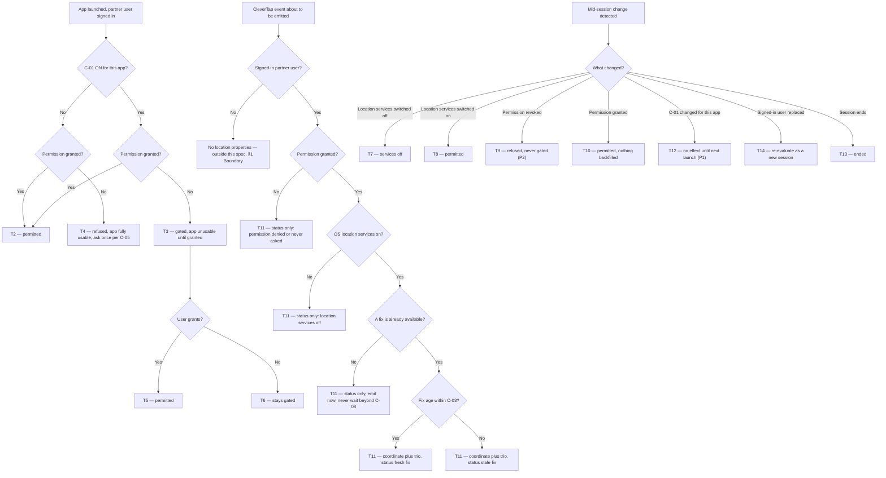

# Partner Action Location — location on every analytics event

| | | | |
|---|---|---|---|
| **Owner** — Ashish Raj (PM) | **Reviewer** — TBD (Eng Lead) | **Status** — Draft | **Sign-off** — Pending |
| **Version** — v0.2 · 29 Jul 2026 | **Consulted — Legal/DPDP** — TBD | **Consulted — Android** — TBD | **Consulted — Analytics/CleverTap** — TBD |

---

## 1. Objective & Definition of Success

**Objective.** For any action a partner user takes in the CSP app or the Technician app, Wiom can tell where that person physically was — precise enough to tell a partner's own premises apart from a customer's address, and honest enough that every reading declares its own reliability.

> **No customer outcome.** This is an internal analytics capability; no customer experience changes. Recorded as **OV-1**.

**Boundary.** This spec governs the **location properties attached to CleverTap events** emitted by the CSP app and the Technician app — every module, every service, every partner-user role (C-02). It changes no service's behaviour, no state machine, and no backend contract. Location from this feature reaches **CleverTap only**; it is never written to a Wiom backend store (R6, AC-REG-2). The **customer app is entirely out of scope** (AC-REG-1). Only **foreground** location is in scope: neither app may request or use background or all-the-time location for this feature (R1-c MUST NOT, AC-REG-6). The only circumstance in which this feature may prevent a partner from working is the app-launch gate, and only while C-01 is ON for that app (R5). The existing use of `ACCESS_FINE_LOCATION` for WiFi scanning during router configuration must continue to work unchanged (AC-REG-3).

### Guardrails — promises that hold on every path

| ID | Guardrail | One line | Anchors |
|---|---|---|---|
| G1 | **Self-describing rows** ⚠️ *AI GENERATED — review* | No coordinate is ever emitted without its reliability trio — accuracy, fix age, mock flag. | R2a · R2b · R2c · AC-ENR-1 · AC-GRD-1 · MQ-2 |
| G2 | **No silent gap** ⚠️ *AI GENERATED — review* | Every partner-user event carries a location status, so a missing coordinate is always explained rather than merely absent. | R3a · AC-ENR-4 · AC-GRD-2 · MQ-3 |
| G3 | **No block except the launch gate** ⚠️ *AI GENERATED — review* | While C-01 is OFF for an app, no partner action is ever blocked, delayed or degraded by location — including event emission itself. | R4c · R5c · AC-GRD-3 · MQ-4 |
| G4 | **No consequence without corroboration** ⚠️ *AI GENERATED — review* | Location is never the sole basis for a payout, posture, access or disciplinary consequence against an individual; it may direct an investigation that stands on other evidence. | R7b · AC-GRD-4 · MQ-5 |
| G5 | **CleverTap only** ⚠️ *AI GENERATED — review* | Location captured by this feature exists in CleverTap and its analytics mirror, and nowhere else in Wiom. | R6a · R6b · AC-GRD-5 · AC-REG-2 · MQ-6 |

### Success metrics

| ID | Metric | Baseline | Target | Source |
|---|---|---|---|---|
| M1 | Partner-user events carrying a high-confidence fix (accuracy within C-04, age within C-03) | n/a — new capability | ≥ 80% ⚠️ *AI GENERATED — review* | MQ-2 |
| M2 | Partner users who are **analysable** — at least C-06 of their events in a rolling 7 days are high-confidence | n/a — new capability | ≥ 90% ⚠️ *AI GENERATED — review* | MQ-2 · MQ-7 |
| M3 | Signed-in partner users whose CleverTap profile carries a populated role | n/a — never measured ⚠️ *AI GENERATED — review* | 100% | MQ-8 |

**Invariant (not a metric):** G3 — partner actions blocked, delayed or degraded by location while C-01 is OFF for that app = 0, zero tolerance. Monitored via MQ-4, not trended.

**Invariant (not a metric):** G5 — location values from this feature found in any Wiom backend store = 0, zero tolerance. Monitored via MQ-6, not trended.

---

## 2. User Stories & Rules

| ID | Story | MUST | MUST NOT |
|---|---|---|---|
| R1 | As the PM for partner operations, I want every action a partner user takes in either app to record where it happened, so I can see where each role actually does its job from — and trace a booking that was created at the partner's own shop rather than at the customer's address. | **(a)** Attach latitude and longitude to every CleverTap event emitted by a signed-in partner user, in both apps, across every module and service. **(b)** Apply the same treatment to every event type already instrumented — screen views, taps, and state-changing actions alike. | **(a)** Attach location to events from the customer app. **(b)** Attach location to events from a user who is not signed in as a partner user. **(c)** Request or use background or all-the-time location for this feature — foreground only. ⚠️ *AI GENERATED — review* |
| R2 | As an analyst acting on a named individual's data, I need each coordinate to declare how much it can be trusted, so I never place a person somewhere on the strength of a city-level or hours-old reading. | **(a)** Attach the accuracy radius in metres to every event that carries a coordinate. **(b)** Attach the age of the fix in seconds to every event that carries a coordinate, measured from the instant the fix was obtained to the instant the action happened — **not** to the instant the event reaches CleverTap, so an event held on the device and uploaded later still states its true age. ⚠️ *AI GENERATED — review* **(c)** Attach a mock-location flag to every event that carries a coordinate. | Emit a latitude or longitude without its accuracy, its age and its mock flag on the same event (G1). |
| R3 | As an analyst, I need to know why a coordinate is missing, so that absence is a finding rather than a hole. | **(a)** Attach a location status to **every** partner-user event, including events with no coordinate, drawn from: fresh fix · stale fix · permission denied · permission never asked · location services off. **(b)** Treat an approximate-only permission grant as granted, and report the resulting coordinate with the large accuracy radius the device actually gives — never as a precise fix. ⚠️ *AI GENERATED — review* | Emit a partner-user event with the status absent or empty (G2). |
| R4 | As a partner user, when location sharing is not compulsory for my app, I want to be asked rather than forced, and I want my refusal respected without it costing me work. | **(a)** While C-01 is OFF for the app, ask for location permission at launch and allow the user to decline. **(b)** Re-ask no more often than once per C-05. **(c)** Let every action complete normally after a refusal, with events carrying the status from R3a. | **(a)** Block, delay or degrade any action because location was refused (G3). **(b)** Re-ask more often than C-05 allows. **(c)** Treat a refusal as a reason to hide, disable or reorder any task. |
| R5 | As the PM, I want the option to make location sharing compulsory for one app without making it compulsory for both, so I can turn it on where the data matters and leave it off where the risk is higher. | **(a)** Read C-01 for the running app at every launch. **(b)** While C-01 is ON and permission is not granted, hold the user at a launch gate: the app is unusable until permission is granted. **(c)** Evaluate the gate at launch only — never interrupt a session already in progress. | **(a)** Apply the gate while C-01 is OFF for that app. **(b)** Gate a live session because permission was revoked mid-session, or because C-01 was switched ON mid-session (T9, T12). **(c)** Let one app's setting change the other app's behaviour. |
| R6 | As the PM, I want location confined to CleverTap, so this feature adds no new store of sensitive data inside Wiom. | **(a)** Send location only as CleverTap event properties. **(b)** Leave every Wiom backend request unchanged — no new field, no new endpoint, no new column. | **(a)** Write any location value from this feature to a Wiom service database, log or backend endpoint (G5). **(b)** Reuse this feature's fix to populate any existing location column that is empty today. |
| R7 | As the PM, I need to analyse a named individual and a named booking, because "which partner did this" is the question the data exists to answer. | **(a)** Permit analysis down to an individual partner user, a named booking and a named action. **(b)** Require evidence other than location before any payout, posture, access or disciplinary consequence is applied to an individual. ⚠️ *AI GENERATED — review* | Apply a consequence to an individual on the strength of location data alone (G4). ⚠️ *AI GENERATED — review* |
| R8 | As an analyst, I want to split behaviour by role, because the whole question is whether OWNERs, TECHNICIANs, MANAGERs and MANAGER+ work from different places. ⚠️ *AI GENERATED — review* | **(a)** Populate the role on the CleverTap profile of every signed-in partner user, in both apps. **(b)** Re-establish the role when the signed-in user changes without the app restarting. | Infer role from the app a user signed in from — a MANAGER may use either app. |

---

## 3. System Behaviour

### 3a. System flow chart

**Precedence.**
- **P1 — the gate is a launch-time decision.** A C-01 change that lands while a session is live never gates or un-gates that session; it takes effect at the next launch (T12, AC-RACE-1, AC-RACE-2).
- **P2 — mid-session revocation never gates.** Permission revoked by the OS or the user during a live session moves the session to refused, not gated, even while C-01 is ON. The gate reapplies at the next launch (T9, AC-RACE-3).
- **P3 — the event never waits for the fix.** An event that fires while a fix request is in flight is emitted immediately with whatever fix already exists and that fix's true age, or with status only if none exists. Emission is never delayed beyond C-08 (AC-RACE-4, G3).

### 3b. State transition table — canon

Lifecycle of the **location context of an app session** (created when a partner user opens either app while signed in). The partner user's OS-level permission state persists across sessions and belongs to Android, not to this lifecycle; it appears here only as a trigger. Neighbouring lifecycles out of scope: every service's own task and candidate lifecycles, the customer app's session, and the router-configuration WiFi-scanning flow, which reads the same OS permission but is untouched by this spec.

**The six states.** **Undetermined** — session open, permission state not yet evaluated. **Permitted** — permission granted and device location services on; coordinates obtainable. **Gated** — C-01 ON and permission not granted; the app is unusable. **Refused** — permission not granted while the session continues unblocked, either because C-01 is OFF or because permission was revoked mid-session. **Services off** — permission granted but the device's location services are switched off. **Ended** — the session has closed; terminal.

| ID | From | Action / Trigger | Rule / Check | To | Side-effects |
|---|---|---|---|---|---|
| T1 | — | Partner user opens the app while signed in | — | Undetermined | Session location context created; C-01 read for the running app (R5a); role established on the analytics profile (R8a). |
| T2 | Undetermined | Permission state evaluated | Permission granted | Permitted | Events begin carrying coordinate plus trio per T11 (R1a, R2). No permission prompt is shown. |
| T3 | Undetermined | Permission state evaluated | Permission not granted **and** C-01 ON for this app | Gated | App held at the launch gate and unusable; the reason for the requirement is shown; the only ways out are granting permission or leaving the app (R5b). |
| T4 | Undetermined | Permission state evaluated | Permission not granted **and** C-01 OFF for this app | Refused | Permission asked at most once per C-05 (R4b); app fully usable; every event carries status only (R3a, R4c, G3). |
| T5 | Gated | Partner user grants permission | — | Permitted | Gate cleared within the same session; app usable; events begin carrying coordinate plus trio (R2). |
| T6 | Gated | Partner user declines, dismisses, or backgrounds the app | — | Gated | App stays unusable; no partner action becomes available (R5b). No event other than the gate's own instrumentation is emitted. |
| T7 | Permitted | Device location services switched off | — | Services off | Events carry status *location services off* with no coordinate (R3a, G2). No action is blocked (G3). |
| T8 | Services off | Device location services switched on | — | Permitted | Events resume carrying coordinate plus trio (R2). Nothing is backfilled. |
| T9 | Permitted · Services off | Permission revoked mid-session | — | Refused | Events carry status *permission denied*; the session is **not** gated even while C-01 is ON (R5-b MUST NOT, P2); the gate reapplies at the next launch. |
| T10 | Refused | Partner user grants permission later | — | Permitted | Events resume carrying coordinate plus trio; nothing is backfilled for events already emitted (R2). |
| T11 | Permitted · Refused · Services off | A CleverTap event is emitted | Dispatched by the §3a event chart | *No change* | Event carries: coordinate when one is available; accuracy in metres, fix age in seconds and mock flag whenever a coordinate is present (R2a, R2b, R2c, G1); location status always (R3a, G2). Age states the fix-to-action interval even if the event reaches CleverTap much later (R2b). Emission is never delayed beyond C-08 (P3, G3). Nothing is written to any Wiom backend (R6, G5). |
| T12 | Undetermined · Permitted · Refused · Services off · Gated | C-01 changed for this app | — | *No change* | Takes effect at the next launch only (P1). A live session is never gated or un-gated by the change (R5c). |
| T13 | Undetermined · Permitted · Refused · Services off · Gated | App session ends | — | Ended | Session location context discarded; no fix is retained by the app between sessions ⚠️ *AI GENERATED — review*. |
| T14 | Undetermined · Permitted · Refused · Services off · Gated | The signed-in partner user is replaced without the app restarting | — | Undetermined | Context re-evaluated from T1, including C-01 and the gate; role re-established for the new user (R8b); no fix obtained under the previous user is carried into the new user's events ⚠️ *AI GENERATED — review*. |

---

## 4. Screen Requirements

**Experience intent:** a partner user should understand in one screen why Wiom is asking where they are, and — when the app is not gating them — should never feel that saying no cost them work.

**Master design file:** **not yet created — named gap.** ⚠️ *AI GENERATED — review* The three screens below need design before build.

### Launch gate — design link TBD

**States:** blocked (C-01 ON for this app and permission not granted — T3, T6) · clearing (permission granted, gate dismissing — T5) · permanently denied (the OS will no longer show the permission prompt; the user must change it in device settings) ⚠️ *AI GENERATED — review*
**Freshness:** evaluated once per launch (R5c); reflects a permission grant immediately

| Element | Source / Routes to | Logic |
|---|---|---|
| Field — why location is required | static copy | always shown in blocked state; states that Wiom records where work is done, and that the app cannot be used without it while the requirement is on (R5b) |
| Action — grant location | T5 via §3a | shown in blocked state; opens the OS permission prompt |
| Action — open device settings | T5 via §3a | shown only in permanently denied state, when the OS will no longer show the prompt |
| Check — no bypass | — | no dismiss, skip, back or "later" affordance exists in the blocked state; leaving the app is the only alternative (R5b, T6) |
| Check — gate is per app | C-01 | the gate appears only when C-01 is ON for the running app (R5-a MUST NOT) |

### Location ask sheet — design link TBD

**States:** asking (C-01 OFF, permission not granted, and the last ask was more than C-05 ago — T4) · not shown (asked within C-05, or permission already granted) ⚠️ *AI GENERATED — review*
**Freshness:** on launch

| Element | Source / Routes to | Logic |
|---|---|---|
| Field — why Wiom asks | static copy | states the purpose plainly; must not imply that work depends on it (R4-c MUST NOT) |
| Action — share location | T10 via §3a | opens the OS permission prompt |
| Action — not now | T4 via §3a | dismisses; app remains fully usable (R4c, G3) |
| Check — ask frequency | C-05 | not shown again within C-05 of the last ask (R4b) |

### Location services prompt — design link TBD

**States:** shown (permission granted but device location services are off — T7) · not shown (services on) ⚠️ *AI GENERATED — review*
**Freshness:** on detection of the services state changing

| Element | Source / Routes to | Logic |
|---|---|---|
| Field — services-off notice | T7 | explains that location is on for the app but off on the device |
| Action — open location settings | T8 via §3a | routes to the OS toggle |
| Check — non-blocking | — | dismissible in every case, including while C-01 is ON — the gate governs permission, not the device toggle (G3) ⚠️ *AI GENERATED — review* |

---

## 5. Configurability

| ID | Parameter | Default | Range | Who changes it |
|---|---|---|---|---|
| C-01 | Mandatory-location launch gate, held separately for the CSP app and the Technician app (R5) | OFF for both apps ⚠️ *AI GENERATED — review* | ON / OFF per app | Product |
| C-02 | Roles in scope for location capture (R1a) | OWNER, TECHNICIAN, MANAGER, MANAGER+ | Fixed in V1 | Product |
| C-03 | Maximum fix age still reported as a fresh fix (R3a, T11) | 60 seconds ⚠️ *AI GENERATED — review* | 30–300 s ⚠️ *AI GENERATED — review* | Product + Eng |
| C-04 | Maximum accuracy radius for a fix to count as high-confidence in analysis (M1, MQ-2) | 100 metres ⚠️ *AI GENERATED — review* | 50–500 m ⚠️ *AI GENERATED — review* | Product |
| C-05 | Minimum interval between location asks while C-01 is OFF (R4b) | 24 hours ⚠️ *AI GENERATED — review* | 6–168 h ⚠️ *AI GENERATED — review* | Product |
| C-06 | Share of a user's rolling-7-day events that must be high-confidence for that user to count as analysable (M2) | 60% ⚠️ *AI GENERATED — review* | Fixed in V1 | Product |
| C-07 | Retention of location properties in CleverTap (MQ-5, Legal gate) | TBD — Legal-gated ⚠️ *AI GENERATED — review* | TBD | Legal + Product |
| C-08 | Maximum time an event may wait for a fix before being emitted without one (P3, R4a) | 0 seconds — never wait ⚠️ *AI GENERATED — review* | 0–3 s ⚠️ *AI GENERATED — review* | Engineering |

**Interaction note (C-03 × C-08):** because C-08 defaults to zero, the app never pauses an event to obtain a fresh fix. An event therefore carries whatever fix already exists, and its status is *fresh fix* or *stale fix* purely on the C-03 comparison. Raising C-08 above zero shifts events from *stale fix* toward *fresh fix* at the cost of delaying emission — it does not change what either status means. ⚠️ *AI GENERATED — review*

**Interaction note (C-03 × C-04):** the two thresholds are independent and both must pass for M1. A fix 5 seconds old with a 3 km radius is fresh but not high-confidence; a fix 10 minutes old with an 8 m radius is high-confidence in precision but stale in time. Analysis that names an individual uses both filters together (R2, R7b). ⚠️ *AI GENERATED — review*

---

## 6. Measurement

| ID | The system must be able to answer… | Feeds |
|---|---|---|
| MQ-1 | For a named partner user over a named date range: where was each of their actions performed, broken down by role, by app and by service. | Objective · R1a · R7a · R8a |
| MQ-2 | For each partner-user event: the accuracy radius, the fix age, and whether the fix was mock — and therefore whether the event is high-confidence against C-03 and C-04. | G1 · M1 · M2 · C-03 · C-04 |
| MQ-3 | For partner-user events carrying no coordinate: the reason, by status value, split by app and role. | G2 · R3a |
| MQ-4 | Whether any partner action was blocked, delayed or degraded because of location while C-01 was OFF for that app — including events delayed past C-08. | G3 invariant · R4c · R5c · C-08 |
| MQ-5 | For any consequence applied to a partner user, what non-location evidence supported it. | G4 · R7b · C-07 |
| MQ-6 | Whether any location value produced by this feature appears in any Wiom backend store, log or request. | G5 invariant · R6a · R6b |
| MQ-7 | For each partner user: the share of their rolling-7-day events that are high-confidence, and therefore whether they are analysable. | M2 · C-06 |
| MQ-8 | The share of signed-in partner users whose analytics profile carries a populated role. | M3 · R8a · R8b |
| MQ-9 | For a named booking: what share of its actions occurred within C-04 of the partner's own registered premises rather than the customer address. ⚠️ *AI GENERATED — review* | Objective · R1a · R7a |
| MQ-10 | The count and identity of partner users emitting mock-location fixes. ⚠️ *AI GENERATED — review* | G1 · R2c |
| MQ-11 | The share of partner-user coordinates obtained under an approximate-only permission grant, so coarse fixes are not mistaken for imprecise precise ones. ⚠️ *AI GENERATED — review* | R3b · C-04 · M1 |

---

## 7. Acceptance Criteria

All examples use a synthetic partner ⚠️ *AI GENERATED — review*: CSP **WIOM-GGN-0472**, owner **Ramesh Kumar** (`csp_owner_88214`, role OWNER), technician **Sunil Yadav** (`tech_31907`, role TECHNICIAN), shop at **28.4212, 77.0431** (Gurugram), and booking **BKG-2026-07-118342** whose customer address is **28.4389, 77.0512** — 2.1 km from the shop.

### LAUNCH — Session start, the gate, and role (T1–T6, T8–T10, T13, T14)

| AC | Given / When / Then | Verifies | Status |
|---|---|---|---|
| AC-LAUNCH-1 | **Given** C-01 is OFF for the CSP app and Ramesh has never been asked for location, **When** he opens the CSP app on 30 Jul at 09:00, **Then** the location ask sheet is shown, and after he taps "not now" he reaches the home feed and can open and act on every task exactly as before. | R4a · R4c · T1 · T4 · G3 | Settled |
| AC-LAUNCH-2 | **Given** C-01 is ON for the Technician app and Sunil has denied location permission, **When** he opens the Technician app, **Then** he is held at the launch gate with no dismiss, skip or back affordance, and no task, feed or action is reachable. | R5b · T3 · T6 | Settled |
| AC-LAUNCH-3 | **Given** Sunil is held at the gate from AC-LAUNCH-2, **When** he grants location permission, **Then** the gate clears in the same session and his next event carries a coordinate with accuracy, age and mock flag. | R5b · R2a · R2b · R2c · T5 · G1 | Settled |
| AC-LAUNCH-4 | **Given** C-01 is ON for the Technician app and OFF for the CSP app, and Ramesh has denied location permission, **When** he opens the **CSP** app, **Then** no gate appears and the app is fully usable. | R5-a MUST NOT · R5-c MUST NOT · T4 | Settled |
| AC-LAUNCH-5 | **Given** Ramesh refused location on 30 Jul at 09:00 with C-05 at 24 h, **When** he opens the CSP app again on 30 Jul at 18:00, **Then** no ask sheet is shown. | R4b · R4-b MUST NOT · C-05 · T4 | Settled |
| AC-LAUNCH-6 | **Given** the same refusal on 30 Jul at 09:00 with C-05 at 24 h, **When** he opens the CSP app on 31 Jul at 09:30, **Then** the ask sheet is shown once. | R4a · R4b · C-05 · T4 | Settled |
| AC-LAUNCH-7 | **Given** Ramesh granted location and is mid-way through a task, **When** he revokes location permission from Android settings without closing the app and C-01 is ON for the CSP app, **Then** he is **not** gated, the task continues to completion, and his subsequent events carry status *permission denied* with no coordinate. | R5-b MUST NOT · T9 · P2 · G2 · G3 | Settled |
| AC-LAUNCH-8 | **Given** Sunil already granted location permission in an earlier session and C-01 is ON for the Technician app, **When** he opens the app, **Then** no gate and no permission prompt appear, and his first event carries a coordinate with accuracy, age and mock flag. | R5a · T2 · R2 · G1 | Settled |
| AC-LAUNCH-9 | **Given** Sunil in a live session with permission granted and device location services switched off, **When** he switches device location services back on, **Then** his subsequent events carry coordinates again and no earlier event is altered. | T7 · T8 · R2 | Settled |
| AC-LAUNCH-10 | **Given** Ramesh refused location at launch with C-01 OFF and has been working for an hour, **When** he grants permission from the location services prompt, **Then** his subsequent events carry coordinates and the events already emitted still carry status *permission denied* with no coordinate added. | T10 · R2 · G2 | Settled |
| AC-LAUNCH-11 | **Given** Sunil signed in on a shared handset with a fix obtained at the customer address, **When** he signs out and Ramesh signs in on the same handset without the app restarting, **Then** the gate and C-01 are re-evaluated for Ramesh, Ramesh's profile carries role OWNER, and no event of Ramesh's carries the fix obtained while Sunil was signed in. | T14 · R8b · R1-b MUST NOT | Settled |
| AC-LAUNCH-12 | **Given** Ramesh has a live session with a fix available, **When** he closes the app and reopens it after 4 hours with location services off, **Then** his first event of the new session carries status *location services off* and no coordinate — the previous session's fix is not reused. | T13 · T1 · R3a · G2 | Settled |
| AC-LAUNCH-13 | **Given** a MANAGER+ user, **When** they sign in to the CSP app and then, later, to the Technician app, **Then** their CleverTap profile carries role MANAGER+ in both cases. | R8a · R8-MUST NOT · M3 | Settled |

### ENR — Event enrichment (T11)

| AC | Given / When / Then | Verifies | Status |
|---|---|---|---|
| AC-ENR-1 | **Given** Sunil has location granted and the device holds a fix of 28.4390, 77.0511 with a 12 m radius obtained 8 seconds ago, **When** the `slot_proposed` event fires for BKG-2026-07-118342, **Then** the event carries that latitude and longitude, accuracy 12 m, age 8 s, mock flag false, and status *fresh fix*. | R1a · R2a · R2b · R2c · R3a · T11 · G1 | Settled |
| AC-ENR-2 | **Given** the same conditions but the only available fix is 14 minutes old with a 2,400 m radius, **When** the event fires, **Then** it carries that coordinate, accuracy 2,400 m, age 840 s, mock flag false, and status *stale fix* — and the event is not delayed to obtain a better fix. | R2a · R2b · R3a · T11 · P3 · C-03 · C-08 | Settled |
| AC-ENR-3 | **Given** Ramesh has location granted but device location services are switched off, **When** he opens a task drilldown, **Then** the **screen-view** event carries status *location services off*, no latitude, no longitude, and no accuracy, age or mock flag. | R1b · R3a · T7 · T11 · G2 | Settled |
| AC-ENR-4 | **Given** Ramesh has never been asked for location because C-01 is OFF and C-05 has not elapsed since install, **When** any event fires, **Then** it carries status *permission never asked* and no coordinate — the status property is present and non-empty on every such event. | R3a · T11 · G2 | Settled |
| AC-ENR-5 | **Given** a device running a mock-location provider reporting 28.4389, 77.0512 — the customer address — while Sunil is physically at the shop, **When** he submits any install step, **Then** the event carries that coordinate with mock flag **true**. | R2c · T11 · G1 · MQ-10 | Settled |
| AC-ENR-6 | **Given** a customer using the customer app at 28.4389, 77.0512, **When** any customer-app event fires, **Then** it carries no latitude, no longitude and no location status. | R1-a MUST NOT · §1 Boundary | Settled |
| AC-ENR-7 | **Given** the CSP app open at the login screen with nobody signed in, **When** any event fires from that screen, **Then** it carries no latitude, no longitude and no location status. | R1-b MUST NOT | Settled |
| AC-ENR-8 | **Given** Sunil granted **approximate** location only, and the device returns 28.44, 77.05 with a 2,000 m radius, **When** any event fires, **Then** it carries that coordinate with accuracy 2,000 m and a status of *fresh fix* or *stale fix* on the C-03 test alone — and the event does not count toward M1 at C-04's 100 m default. | R3b · R2a · C-04 · M1 · MQ-11 | Settled |
| AC-ENR-9 | **Given** Sunil acting at 14:00 with a fix obtained at 13:59:30, and the handset offline until 20:00, **When** the event reaches CleverTap at 20:00, **Then** its age reads 30 s, not 6 hours 30 s. | R2b · T11 | Settled |

### WF — Workflows (T1 → T4 → T11, and T1 → T3 → T5 → T11)

| AC | Given / When / Then | Verifies | Status |
|---|---|---|---|
| AC-WF-1 | **Given** C-01 OFF for the CSP app and Ramesh refusing location on 30 Jul at 09:00, **When** he then works a full day — opens the feed, proposes a slot on BKG-2026-07-118342, assigns Sunil, and reports one install failed — **Then** every one of those actions completes normally, every emitted event carries status *permission denied* with no coordinate, the feed's task order and visibility are identical to a permission-granted user's, and no screen at any point told him an action was unavailable. | R4c · R4-c MUST NOT · T4 · T11 · G2 · G3 | Settled |
| AC-WF-2 | **Given** C-01 ON for the Technician app and Sunil with permission denied, **When** he opens the app, is gated, grants permission, and then completes the on-site sequence for BKG-2026-07-118342 through to the customer rating, **Then** the gate appeared exactly once at launch, every event from the sequence carries a coordinate with accuracy, age and mock flag, and the install completed with no additional location prompt. | R5b · R5c · R2 · T3 · T5 · T11 · G1 | Settled |

### FAIL — Emission never depends on location (T11, C-08)

| AC | Given / When / Then | Verifies | Status |
|---|---|---|---|
| AC-FAIL-1 | **Given** C-08 at its 0-second default and a fix request in flight with no fix yet available, **When** Sunil taps a state-changing CTA, **Then** the event is emitted immediately with status only, the CTA's own action completes with no added latency, and nothing waits for the fix. | P3 · C-08 · G3 · MQ-4 | Settled |
| AC-FAIL-2 | **Given** the CleverTap SDK failing to initialise on Ramesh's device, **When** he proposes a slot, **Then** the slot proposal completes normally and no location prompt, error or block is shown. | G3 · R4-a MUST NOT | Settled |

### REG — Regression against the §1 Boundary

| AC | Given / When / Then | Verifies | Status |
|---|---|---|---|
| AC-REG-1 | **Given** this feature live in both partner apps, **When** the customer app is exercised end to end for BKG-2026-07-118342, **Then** its behaviour, screens and events are unchanged from the pre-change build. | §1 Boundary | Settled |
| AC-REG-2 | **Given** Sunil completing the full install with location granted, **When** every backend request from the session is inspected, **Then** none carries a latitude, longitude, accuracy, fix age or mock flag, and no Wiom service database row contains any of them. | R6a · R6b · G5 · MQ-6 | Settled |
| AC-REG-3 | **Given** C-01 ON for the Technician app and permission granted at the gate, **When** Sunil runs router configuration for BKG-2026-07-118342, **Then** WiFi scanning returns networks and the router-config flow completes exactly as it did before this feature. | §1 Boundary | Settled |
| AC-REG-4 | **Given** C-01 OFF for both apps and permission denied by both users, **When** the full booking-to-install journey for BKG-2026-07-118342 is run, **Then** every state transition, timer and notification behaves exactly as in the pre-change build. | §1 Boundary · G3 | Settled |
| AC-REG-5 | **Given** this feature live and a netbox-recovery proof submission whose location columns are empty today, **When** the submission is made, **Then** those columns remain empty — this feature's fix is not used to populate them. | R6-b MUST NOT · G5 | Settled |
| AC-REG-6 | **Given** either app installed, **When** its declared permissions and runtime requests are inspected, **Then** no background or all-the-time location permission is declared or requested. | R1-c MUST NOT · §1 Boundary | Settled |

### RACE — Precedence rules (P1, P2, P3)

| AC | Given / When / Then | Verifies | Status |
|---|---|---|---|
| AC-RACE-1 | **Given** Sunil in a live Technician-app session with permission denied and C-01 OFF, **When** C-01 is switched ON for the Technician app at 14:00 while his session is open, **Then** his session continues unblocked and no gate appears. | P1 · T12 · R5c | Settled |
| AC-RACE-2 | **Given** the session from AC-RACE-1 with C-01 now ON, **When** Sunil next launches the app, **Then** he is gated. | P1 · T12 · T3 · R5a | Settled |
| AC-RACE-3 | **Given** C-01 ON for the CSP app and Ramesh in a live session with permission granted, **When** Android revokes the permission at 14:00 mid-session, **Then** the session moves to refused and continues unblocked, and the gate appears at his next launch. | P2 · T9 · R5-b MUST NOT | Settled |
| AC-RACE-4 | **Given** a fix request in flight, **When** two events fire in the same 100 ms, **Then** both are emitted immediately, both carry the same best-available fix, and each carries its own true age at its own emission instant. | P3 · R2b · T11 | Settled |

### BV — Boundary values (C-03, C-04, C-05, C-06)

| AC | Given / When / Then | Verifies | Status |
|---|---|---|---|
| AC-BV-1 | **Given** C-03 at 60 s, **When** an event fires carrying a fix aged exactly 60 s, **Then** its status is *fresh fix*. | R3a · C-03 · T11 | Settled |
| AC-BV-2 | **Given** C-03 at 60 s, **When** an event fires carrying a fix aged 61 s, **Then** its status is *stale fix*. | R3a · C-03 · T11 | Settled |
| AC-BV-3 | **Given** C-04 at 100 m, **When** analysis is run over three events with accuracy 99 m, 100 m and 101 m, **Then** the first two count toward M1 and the third does not. | M1 · C-04 · MQ-2 | Settled |
| AC-BV-4 | **Given** C-05 at 24 h and Ramesh's last ask at 30 Jul 09:00, **When** he launches at 31 Jul 08:59, **Then** no ask is shown. | R4b · C-05 · T4 | Settled |
| AC-BV-5 | **Given** the same last ask at 30 Jul 09:00 and C-05 at 24 h, **When** he launches at 31 Jul 09:00, **Then** the ask is shown. | R4b · C-05 · T4 | Settled |
| AC-BV-6 | **Given** C-06 at 60%, **When** one user has 59% of their rolling-7-day events high-confidence and another has 60%, **Then** only the second counts as analysable in M2. | M2 · C-06 · MQ-7 | Settled |

### DUP — Duplicate triggers

| AC | Given / When / Then | Verifies | Status |
|---|---|---|---|
| AC-DUP-1 | **Given** Sunil double-tapping a state-changing CTA 400 ms apart with a fix available, **When** both events are emitted, **Then** each carries the coordinate and the mock flag, and the second carries an age approximately 400 ms greater than the first — neither reuses the other's age. | R2b · R2c · T11 · P3 | Settled |
| AC-DUP-2 | **Given** Ramesh backgrounding and immediately reopening the CSP app three times inside C-05 with C-01 OFF, **When** each launch is evaluated, **Then** the ask sheet is shown at most once across all three. | R4b · R4-b MUST NOT · C-05 · T4 | Settled |
| AC-DUP-3 | **Given** Sunil at the gate with C-01 ON, **When** he grants permission and then relaunches the app twice, **Then** no gate appears on either relaunch and no permission prompt is shown. | T5 · T2 · R5b | Settled |

### CFG — Configurability

| AC | Given / When / Then | Verifies | Status |
|---|---|---|---|
| AC-CFG-1 | **Given** C-01 OFF for both apps, **When** it is switched ON for the CSP app only, **Then** the next CSP-app launch by a permission-denied user is gated and the next Technician-app launch by the same user is not. | R5a · R5-c MUST NOT · C-01 · T3 | Settled |
| AC-CFG-2 | **Given** C-03 at 60 s and an event carrying a 90-second-old fix reported as *stale fix*, **When** C-03 is raised to 300 s, **Then** the next equivalent event reports *fresh fix* with no app release. | R3a · C-03 · T11 | Settled |
| AC-CFG-3 | **Given** C-05 at 24 h and Ramesh having refused 30 hours ago, **When** C-05 is lowered to 6 h, **Then** his next launch shows the ask sheet, with no app release. | R4b · C-05 · T4 | Settled |

### GRD — Guardrails

| AC | Given / When / Then | Verifies | Status |
|---|---|---|---|
| AC-GRD-1 | **Given** any sample of partner-user events carrying a coordinate, **When** the sample is inspected, **Then** every one also carries accuracy, fix age and mock flag — zero coordinates appear without all three. | G1 · R2a · R2b · R2c · MQ-2 | Settled |
| AC-GRD-2 | **Given** any sample of partner-user events, **When** the sample is inspected, **Then** every event carries a non-empty location status from the R3a set. | G2 · R3a · R3-MUST NOT · MQ-3 | Settled |
| AC-GRD-3 | **Given** C-01 OFF for both apps across a full week of production traffic, **When** MQ-4 is run, **Then** zero partner actions were blocked, delayed or degraded by location, and zero events were delayed past C-08. | G3 invariant · R4-a MUST NOT · MQ-4 | Settled |
| AC-GRD-4 | **Given** a partner user whose location data suggests bookings were created at their own shop, **When** any payout, posture, access or disciplinary consequence is applied, **Then** a record of non-location evidence supporting it exists. ⚠️ *AI GENERATED — review* | G4 · R7b · R7-MUST NOT · MQ-5 | Settled |
| AC-GRD-5 | **Given** a full production week, **When** every Wiom service database, log store and backend request schema is searched for this feature's location values, **Then** none is found. | G5 invariant · R6-a MUST NOT · MQ-6 | Settled |
| AC-GRD-6 | **Given** a week of captured events, **When** an analyst queries for Ramesh Kumar's actions between 25 and 31 Jul, **Then** the result lists each action with its coordinate, accuracy, age, mock flag, status, role, app and service. | R7a · MQ-1 · MQ-9 | Settled |

---

## 8. Glossary

| Term | Meaning | Owner (domain) |
|---|---|---|
| Partner user | **Canonical definition:** a person signed in to the CSP app or the Technician app in one of the C-02 roles. Excludes customers and unauthenticated users. All other mentions cite this definition. | Partner operations |
| Fix | A single location reading obtained from the device, carrying a latitude, a longitude, an accuracy radius and the instant it was obtained. | — |
| Accuracy radius | The device's own estimate, in metres, of how far the true position may be from the reported coordinate. A satellite fix is typically tens of metres; a WiFi or cell-derived fix can be hundreds of metres or more. A large radius is not an error — it is an honest statement of imprecision, which is why R2a requires it on every coordinate. | — |
| Fix age | Seconds between the instant a fix was obtained and the instant the action happened. Distinct from accuracy: a fix can be precise and old, or fresh and vague. Distinct from upload time: R2b fixes the interval to the action, not to arrival at CleverTap. | — |
| Fresh fix / stale fix | A fix whose age is within C-03 is reported *fresh*; beyond C-03 it is reported *stale*. The coordinate is emitted either way (T11). | Product |
| High-confidence fix | **Canonical definition:** a fix whose accuracy is within C-04 **and** whose age is within C-03. Only high-confidence fixes count toward M1 and M2, and analysis naming an individual filters on this (R7b). | Product |
| Location status | The single value present on every partner-user event explaining what location it carries. R3a is the canonical list of values; no other section restates it. | Product |
| Approximate-only grant | A permission grant in which Android gives the app a deliberately coarsened position rather than a precise one. The app is granted, so no gate applies, but every resulting coordinate carries a large accuracy radius and will usually fail C-04 (R3b, MQ-11). | — |
| Mock location | A coordinate injected by a mock-location provider rather than measured by the device. Android reports this per fix; R2c requires it on every coordinate so a spoofed reading is never indistinguishable from a real one. | — |
| Mandatory-location launch gate | **Canonical definition:** the state in which an app is unusable until location permission is granted, applied at launch only, and only while C-01 is ON for that app (R5, T3). Referred to elsewhere as "the gate". | Product |
| Partner premises | The partner's own registered place of business, as distinct from any customer address. Needed as a reference point for MQ-9; whether coordinates for it exist today is an open dependency (§9). ⚠️ *AI GENERATED — review* | Partner operations |
| CleverTap | The third-party analytics and engagement platform both apps already send events to, and the sole destination for location under this spec (R6, G5). Its stored events are mirrored into Wiom's analytics warehouse for querying. | Analytics |

---

## 9. Notes for System Capabilities

What the platform must be able to do for this feature to exist. Whether these are one system or several, and how they interact, is the implementer's design.

| Capability | Needed by |
|---|---|
| Obtain a device fix carrying an accuracy radius, the instant it was obtained, and a mock-provider indication — without delaying the action that triggered the event beyond C-08. | R2a · R2b · R2c · T11 · P3 · C-08 |
| Distinguish a precise grant from an approximate-only grant, and report the coordinate the device actually gives in each case. | R3b · MQ-11 |
| Preserve the fix-to-action interval for an event that is held on the device and uploaded later. | R2b · AC-ENR-9 |
| Read the app's location permission state and the device's location-services state, both at launch and when either changes mid-session. | T2 · T3 · T4 · T7 · T8 · T9 · T10 |
| Attach properties to **every** outgoing analytics event from a single place, so no event type can be missed and no callsite needs to know about location. | R1a · R1b · R3a · G1 · G2 |
| Hold a per-app configuration switch, readable at every launch and changeable without an app release. | R5a · C-01 · AC-CFG-1 |
| Change C-03 and C-05 without an app release. | C-03 · C-05 · AC-CFG-2 · AC-CFG-3 |
| Block all app use at launch, with no bypass affordance, and release the block within the same session once permission is granted. | R5b · T3 · T5 · T6 |
| Distinguish "permission denied" from "never asked" from "services off" as separate observable states. | R3a · G2 · MQ-3 |
| Establish a role on the analytics profile of every signed-in partner user, independent of which app they signed in from, and re-establish it when the signed-in user changes without an app restart. | R8a · R8b · M3 · MQ-8 · T14 |
| Discard a fix when the session ends or the signed-in user changes, so no fix crosses a user boundary. | T13 · T14 |
| Query stored location properties per named individual, named booking and named action, over a chosen date range. | R7a · MQ-1 · MQ-9 · AC-GRD-6 |
| Resolve a partner's own registered premises to coordinates, for comparison against where their actions occurred. **Open dependency — no verified source of premises coordinates has been identified.** ⚠️ *AI GENERATED — review* | MQ-9 |
| Detect and report any location value from this feature appearing in a Wiom backend store, log or request. | G5 · MQ-6 |

---

## AI-generated content for review

Ordered with the decisions that most change the document first.

| # | Location | What was generated | Basis |
|---|---|---|---|
| 1 | §2 R7a MUST NOT, R7b · §1 G4 · AC-GRD-4 · MQ-5 | **The whole "no consequence without corroboration" position.** You confirmed per-individual *analysis* is permitted, but did not answer whether *action against an individual* is a hard MUST NOT. I assumed location may direct an investigation but can never be the sole basis for a payout, posture, access or disciplinary consequence. | Direct inference from the Call Logs precedent, which made partner enforcement a MUST NOT (R7) and a guardrail (G1). **This is the single row Legal will key off — confirm or flip it before review.** |
| 2 | §5 C-07 | Retention of location properties in CleverTap left as TBD, Legal-gated. | No retention decision was taken. Call Logs took indefinite retention against a stated DPDP warning and recorded it as OV-2. |
| 3 | §2 R2b · §8 Fix age · AC-ENR-9 · §9 | **Age must be measured to the action, not to arrival at CleverTap.** | Not discussed. Events are held on the device when it is offline; without this rule a six-hour-old fix uploaded later reads as current, which would quietly corrupt every conclusion. |
| 4 | §2 R3b · §8 Approximate-only grant · AC-ENR-8 · MQ-11 · §9 | **Handling of an approximate-only permission grant.** I assumed it counts as granted (so the gate is satisfied) but its coarse coordinate is reported honestly and simply fails C-04. | Not discussed. Android lets a user grant approximate instead of precise; without this rule such users appear tracked while their data can never place them at a premises. The alternative — treating approximate as not-granted and gating on precise — is stricter and is your call. |
| 5 | §2 R1-c MUST NOT · §1 Boundary · AC-REG-6 | **Background location is prohibited; foreground only.** | Not discussed. Data minimisation, and background location carries a materially heavier permission and policy burden for no stated benefit. |
| 6 | §3b T14 · §2 R8b · AC-LAUNCH-11 · §9 | **User-switch handling on a shared handset**, including that no fix crosses a user boundary. | Not discussed. Partner handsets are shared between an OWNER and technicians, so without this rule one person's fix can be attributed to another — the worst possible failure for per-individual analysis. |
| 7 | §5 C-01 default | Gate defaults **OFF for both apps**. | Mirrors Call Logs C-09, the mandatory-permission switch, which defaults OFF. Ships the capture without shipping the block. |
| 8 | §5 C-03 (60 s, 30–300 s) | Fresh/stale boundary. | Common practice for treating a cached fix as current. |
| 9 | §5 C-04 (100 m, 50–500 m) | High-confidence accuracy ceiling. | Chosen so a partner's premises can be told apart from a customer address a few hundred metres away — the office-detection use case. |
| 10 | §5 C-05 (24 h, 6–168 h) | Re-ask interval when the gate is off. | Judgement: frequent enough to recover a refusal, rare enough not to nag. |
| 11 | §5 C-06 (60%) · §1 M2 · AC-BV-6 | The "analysable user" definition and its threshold. | Invented so coverage is measurable per user, not only in aggregate. |
| 12 | §5 C-08 (0 s, 0–3 s) | Event never waits for a fix. | Derived from your G3 direction that nothing may be blocked or degraded; zero is the only value that guarantees it. |
| 13 | §1 M1 (≥ 80%), M2 (≥ 90%), M3 (100%) | All three targets, and M3 itself. | No baseline exists — nothing is captured today. Targets are judgement and should be reset after two weeks of live data. |
| 14 | §2 R8 · §1 M3 · MQ-8 · AC-LAUNCH-13 | **The whole role-population requirement.** | `CleverTapAnalyticsTracker.identifyUser()` pushes a `Role` profile property, but I did not verify it is non-null in production, and the backend transition log collapses every partner role to `'CSP'`. Without role populated, the objective's by-role question is unanswerable. |
| 15 | §1 G1–G5 names and wording | All five guardrails. | Derived from your decisions; the naming and the split into five are mine. |
| 16 | §6 MQ-9 · §8 Partner premises · §9 premises capability | The office-detection measurement and its dependency. | Your brief names this use ("bookings created at CSP office traced back"), but it needs a reference coordinate for the partner's premises. I found no verified source. Flagged as an open dependency rather than assumed. |
| 17 | §6 MQ-10 | Mock-location reporting. | Follows from R2c; you approved capturing the flag but not what it feeds. |
| 18 | §4 all three screens | Screen inventory, states, elements — and the "permanently denied" state, where Android refuses to show the prompt again. | Derived from the gate and ask decisions. **No design file exists; this is a named gap.** |
| 19 | §4 Location services prompt, non-blocking check | That the gate governs permission only, so a services-off device is never blocked even while C-01 is ON. | Judgement. The alternative — gating on the device toggle too — is stricter and would need your call. |
| 20 | §3b T13 | No fix retained by the app between sessions. | Data-minimisation default; not discussed. |
| 21 | §5 both interaction notes | The C-03 × C-08 and C-03 × C-04 interactions. | Derived from the parameters. |
| 22 | §7 all concrete data | Ramesh Kumar, Sunil Yadav, WIOM-GGN-0472, BKG-2026-07-118342, the two Gurugram coordinates, the 2.1 km separation. | Synthetic. `slot_proposed` is a real event name, taken from `CleverTapAnalyticsTracker.kt:28`. Replace with a real case if you want the ACs to double as a production probe. |

**Open question not yet answerable, raised rather than assumed:** a partner who permanently denies location while C-01 is ON is locked out of the app with no route back except device settings, and no support or ops override exists in this spec. If that lockout needs an escape hatch, it is a rule and a screen state this document does not yet have.

---

## Overrides

| Rule | What was done instead | Rationale | Who approved |
|---|---|---|---|
| **OV-1** — §1 requires the Objective to be a customer outcome. | The objective is an internal analytics capability. No customer-facing behaviour changes on any path. | The feature exists to let Wiom understand where partner users work from. There is no customer outcome to state, and inventing one would misdescribe the feature. Same override as the Call Logs PRD. | Ashish Raj (PM), 29 Jul 2026 |
| **OV-2** — §1 requires a baseline for every metric. | M1, M2 and M3 carry "n/a — new capability" or "never measured". | Nothing about partner location is captured today, and CleverTap's IP-derived geo is city-level at best and often resolves to the carrier gateway — it is not a usable proxy baseline. | Ashish Raj (PM), 29 Jul 2026 |
| **OV-3** — §7 AC citations use `Rn-x MUST NOT` for negative sub-obligations. | The template's `R5b` form is ambiguous when both the MUST and MUST NOT cells are lettered, as several rules here are. Negative obligations are cited as `R5-b MUST NOT`. | Without it, coverage of the MUST NOT column cannot be checked mechanically. | Ashish Raj (PM), 29 Jul 2026 |
